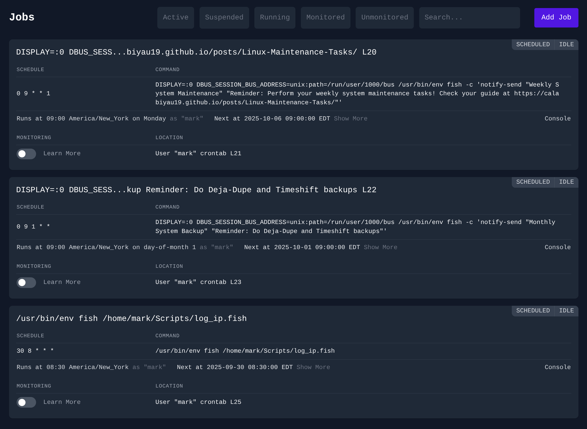
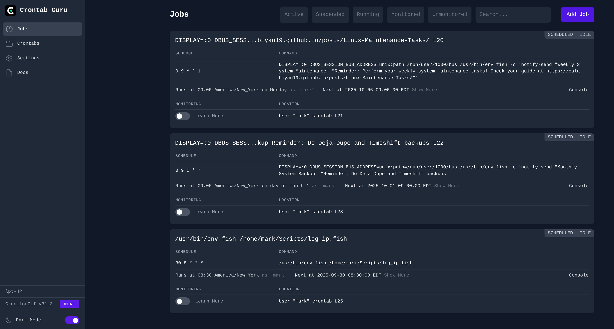
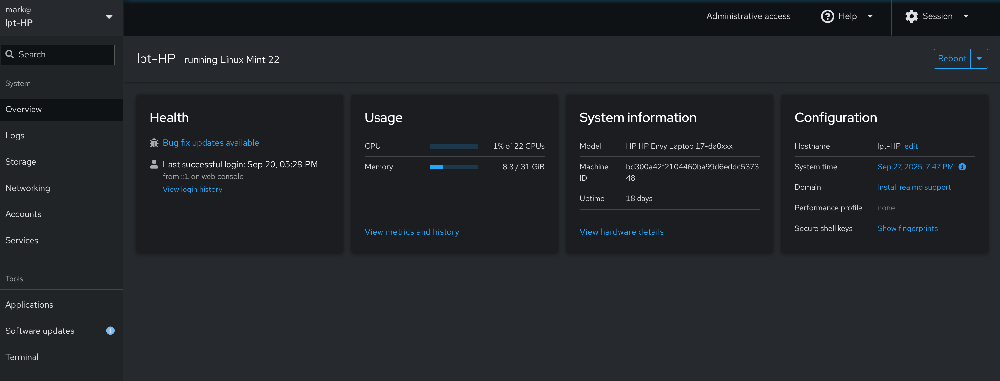
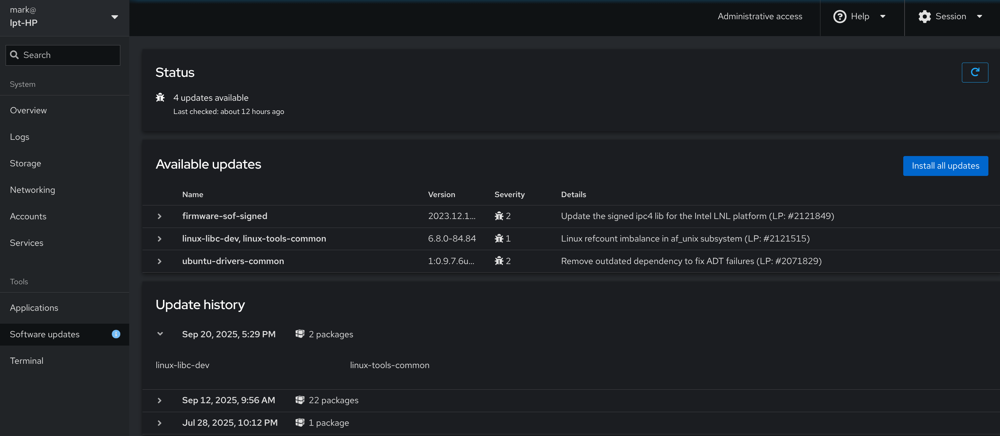

This document explains how **Crontab Guru (Cronitor Dashboard)** and **Cockpit** work on Linux Mint, how they are run, and provides example workflows for daily use.

## Crontab Guru (Cronitor Dashboard)

### What it is

- A **local web dashboard** for managing and monitoring cron jobs
- Accessible at: `http://localhost:9022/`
- Powered by the **Cronitor CLI** (`/usr/bin/cronitor`)
- Configured via `/etc/cronitor/cronitor.json`

<!-- Main focused screenshot -->


<!-- Small thumbnail linking to full view -->
<a href="../assets/images/crontab-full-window.png" target="_blank">
    
</a>
<p>Click for full window view</p>

### How it runs

**Installation:**

```sh
curl https://crontab.guru/install | sh
```

**Managed as a systemd service:**

```sh
sudo systemctl start crontab-guru-dashboard
sudo systemctl stop crontab-guru-dashboard
sudo systemctl restart crontab-guru-dashboard
sudo systemctl status crontab-guru-dashboard
```

**Auto-start on boot:**

```sh
sudo systemctl enable crontab-guru-dashboard
```

### Configuration

The configuration file `/etc/cronitor/cronitor.json` contains:

- `CRONITOR_DASH_USER` / `CRONITOR_DASH_PASS` → dashboard login credentials
- `CRONITOR_USERS` → which system users' crontabs are monitored (e.g., `root, mark`)
- Other fields allow integration with Cronitor Cloud, logging, and hostname overrides

### What you can do with it

- View cron jobs for the configured users
- Track execution times and job history
- Verify new cron entries are picked up
- Use it alongside crontab guru (web tool) for building cron expressions

## Cockpit

### What it is

- A **web-based system administration dashboard**
- Accessible at: `https://localhost:9090/`
- Provides a friendly GUI for managing services, logs, and system health



### What you can do with it

- **System monitoring**: real-time CPU, memory, disk, and network graphs
- **Service management**: start/stop/restart services (e.g., `crontab-guru-dashboard`)
- **Logs**: browse and filter system logs without `journalctl`
- **Storage**: view partitions, usage, and disks
- **Users**: manage accounts, sessions, and passwords
- **Software updates**: install updates via GUI (with `cockpit-packagekit`)



### Good ways to use Cockpit

- Quick health check after boot
- Service control without terminal commands
- Searching through system logs when debugging
- Remote system management (optional, if secured)

## Example Workflows

### 1. Add a new cron job and verify in Crontab Guru

```sh
crontab -e
```

Example job:

```sh
0 3 * * * /home/mark/scripts/backup.sh
```

1. Save and exit
2. Open `http://localhost:9022/` → log in → verify the job appears under user `mark`

### 2. Restart a failed service in Cockpit

1. Open `https://localhost:9090/` → log in
2. Go to **Services**
3. Search for `crontab-guru-dashboard`
4. If it's failed or inactive → click **Restart**

### 3. Check system health before troubleshooting

1. Open Cockpit → **Overview** page
2. Check CPU/Memory/Disk graphs for spikes
3. Open **Logs** → filter by "Error" or "Warning"

### 4. Manage Crontab Guru via systemd

**Restart dashboard:**

```sh
sudo systemctl restart crontab-guru-dashboard
```

**Check status:**

```sh
systemctl status crontab-guru-dashboard --no-pager
```

**Enable auto-start on boot:**

```sh
sudo systemctl enable crontab-guru-dashboard
```

## Summary

- **Crontab Guru (Cronitor Dashboard)** gives visibility into cron jobs and schedules
- **Cockpit** provides a full system management dashboard (services, logs, performance, storage)
- Together, they let you manage **scheduled jobs** and **system health** from easy-to-use interfaces

## Additional Resources

- [Crontab Guru Website](https://crontab.guru/) - Build cron expressions
- [Cockpit Documentation](https://cockpit-project.org/documentation.html)
- [Systemd Service Management](https://www.freedesktop.org/software/systemd/man/systemctl.html)
