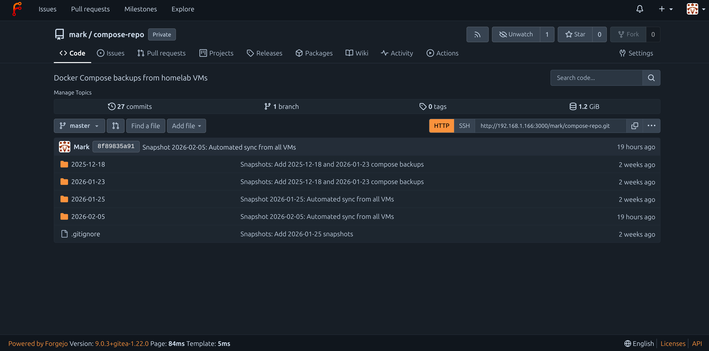

## Setting Up Forgejo as a Git Repository GUI

Forgejo is a self-hosted Git server that provides a web-based interface for managing Git repositories. Unlike a bare Git repository (which is just the raw Git data without a working directory), Forgejo offers a complete web interface similar to GitHub or GitLab, allowing you to browse files, view commit history, compare changes, and manage multiple repositories all from your browser. This guide walks through installing Forgejo on an Ubuntu VM, migrating an existing bare Git repository to Forgejo, and integrating it with your automated backup workflow.

## Prerequisites

Before beginning this setup, you should have Docker and Docker Compose installed on your target VM. This guide assumes you're working with an Ubuntu-based system and have basic familiarity with SSH, Git, and Docker concepts.

## Why Use Forgejo

A bare Git repository stores version history but provides no way to easily browse files or view changes without command-line tools. Forgejo solves this by providing a web interface where you can click through your repository's file structure, view any commit's changes with color-coded diffs, search across files, and see your repository's activity timeline. For infrastructure backups like Docker Compose files, this means you can quickly find that working configuration from three months ago or see exactly what changed between two backup snapshots without running a series of Git commands.

## System Architecture Overview

This setup creates a three-tier system for managing your Git repositories. The source files live on individual VMs across your network. A sync script on your local machine collects these files and commits them to a local Git repository. This repository then pushes to Forgejo running on a dedicated VM, where you can browse everything through a web interface accessible from any device on your network.

## Installation

### Create Forgejo Directory

Connect to your Git server VM via SSH and create a dedicated directory for the Forgejo installation.

```sh
ssh mark@192.168.1.166
```

Once connected, create the directory structure and navigate into it.

```sh
mkdir -p ~/forgejo && cd ~/forgejo
```

The `-p` flag ensures the directory is created even if the parent directory doesn't exist, and the `&&` chains the commands so you immediately move into the new directory.

### Verify Port Availability

Before configuring Forgejo, confirm that port 3000 is available on your system.

```sh
sudo ss -tlnp | grep :3000
```

This command uses `ss` (socket statistics) to list all listening TCP ports (`-tlnp`) and filters for port 3000. If the output is empty, the port is available. If something is already using port 3000, you'll need to either stop that service or choose a different port in the Forgejo configuration.

### Create Docker Compose Configuration

Create the Docker Compose file that will define how Forgejo runs.

```sh
nano docker-compose.yml
```

Paste the following configuration into nano. This configuration uses Forgejo version 9, sets appropriate user permissions, configures SQLite as the database, and exposes both the web interface on port 3000 and SSH on port 2222.

```yaml
services:
  forgejo:
    image: codeberg.org/forgejo/forgejo:9
    container_name: forgejo
    restart: unless-stopped
    environment:
      - USER_UID=1000
      - USER_GID=1000
      - FORGEJO__database__DB_TYPE=sqlite3
      - FORGEJO__server__DOMAIN=192.168.1.166
      - FORGEJO__server__HTTP_PORT=3000
      - FORGEJO__server__ROOT_URL=http://192.168.1.166:3000/
    volumes:
      - ./data:/data
      - /etc/timezone:/etc/timezone:ro
      - /etc/localtime:/etc/localtime:ro
    ports:
      - "3000:3000"
      - "2222:22"
```

The `USER_UID` and `USER_GID` settings ensure Forgejo runs with your user permissions, preventing file ownership issues. The `FORGEJO__database__DB_TYPE=sqlite3` uses SQLite instead of requiring a separate database container, keeping the setup simple and lightweight. The volume `./data:/data` stores all Forgejo data (repositories, database, configurations) in a local directory, making backups straightforward. The timezone and local time mounts ensure Forgejo displays times in your system's timezone. The restart policy `unless-stopped` means the container will automatically restart if it crashes or if the server reboots, but won't restart if you manually stop it.

Save the file with `Ctrl+O`, press Enter to confirm, then exit nano with `Ctrl+X`.

### Verify Configuration File

Before starting the container, verify the configuration was saved correctly.

```sh
cat docker-compose.yml
```

This displays the file contents, so you can confirm there are no formatting errors or missing sections.

### Start Forgejo Container

Launch Forgejo using Docker Compose.

```sh
docker compose up -d
```

The `up` command starts the services defined in docker-compose.yml, and the `-d` flag runs them in detached mode (in the background). Docker will download the Forgejo image if it's not already present on the system, which may take a minute or two on the first run.

### Verify Container Status

Check that the Forgejo container is running properly.

```sh
docker ps
```

This shows all running containers. You should see a container named `forgejo` with status "Up" and health checks passing. If the container shows as restarting repeatedly, check the logs with `docker logs forgejo` to diagnose the issue.

## Initial Configuration

### Access Web Interface

Open a browser and navigate to your Forgejo instance. Replace the IP address with your actual Git server's IP if different.

```
http://192.168.1.166:3000
```

You should see Forgejo's initial setup page with various configuration options.

### Complete Initial Setup

Most settings can remain at their defaults. The database type should already be set to SQLite3, and the server domain and URL should match what you configured in the Docker Compose file. Scroll down to the Administrator Account Settings section at the bottom of the page.

Create your admin account by filling in these fields with your preferred credentials:
- Username: Your desired admin username (e.g., "mark")
- Password: A strong password you'll remember
- Email: Your email address

After filling in the administrator account details, click the "Install Forgejo" button at the bottom of the page. Forgejo will complete its setup and automatically log you in.

### Create Your First Repository

After installation completes, you'll be logged into Forgejo's main interface. Look for a "+" button or "New Repository" option, typically in the top right corner of the interface. Click it to open the repository creation form.

Fill in the repository details:
- Repository Name: `compose-repo` (or whatever name matches your existing Git repository)
- Description: "Docker Compose backups from homelab VMs" (optional but helpful)
- Visibility: Choose Private to keep your infrastructure configurations secure

In the Initialize Repository section, leave ALL checkboxes unchecked. Do not add a README, .gitignore, or license. This is critical because you're migrating an existing repository with its own history. If you initialize the repository with these files, you'll encounter merge conflicts when trying to push your existing history.

Click "Create Repository" to finish. You'll be taken to the new repository's page, which will show a "Quick guide" with commands for pushing an existing repository.

Note the repository URL shown on this page. It will look like `http://192.168.1.166:3000/mark/compose-repo.git`. You'll need this URL in the next steps.

## Migrating from Bare Repository

If you're migrating from an existing bare Git repository setup, follow these steps on your local machine. If you're setting up Forgejo fresh without an existing repository, skip to the Additional Use Cases section for guidance on creating new repositories.

### Navigate to Local Repository

Open a terminal on your local machine (not SSH'd into the server) and navigate to your existing Git repository directory.

```sh
cd ~/compose-repo
```

This is the directory containing your local Git repository that currently pushes to a bare repo.

### Check Current Remote Configuration

View your current Git remote configuration to see where your repository is currently pushing.

```sh
git remote -v
```

This shows the remote URLs for both fetching and pushing. You'll likely see something like `mark@192.168.1.166:~/git-repos/compose-repo.git`, which is the SSH path to your bare repository. The `-v` flag means "verbose" and shows both the remote name (usually "origin") and its URL.

### Remove Old Remote

Remove the existing remote that points to your bare repository.

```sh
git remote remove origin
```

This deletes the bookmark named "origin" but doesn't affect your local files or history. It only removes the connection information that tells Git where to push. Think of it like deleting a contact from your phone - the person still exists, but you've removed their phone number from your contacts list.

### Verify Remote Removal

Confirm the old remote was successfully removed.

```sh
git remote -v
```

This command should now show no output, confirming that there are no configured remotes.

### Add Forgejo Remote

Add the new Forgejo repository as your remote, using the URL you noted from the Forgejo web interface earlier. Replace the URL with your actual Forgejo repository URL if different.

```sh
git remote add origin http://192.168.1.166:3000/mark/compose-repo.git
```

This creates a new bookmark called "origin" that points to your Forgejo repository instead of the old bare repo. The `origin` name is a Git convention for the primary remote repository.

### Confirm New Remote

Verify the new remote was added correctly.

```sh
git remote -v
```

You should now see the Forgejo URL listed for both fetch and push operations.

### Push to Forgejo

Push your entire Git history to Forgejo.

```sh
git push -u origin master
```

The `-u` flag (short for `--set-upstream`) configures this branch to track the remote branch, making future pushes simpler. You'll be prompted for your Forgejo username and password - enter the credentials you created during Forgejo's initial setup. Git will then transfer all your commits and history to Forgejo. Depending on the size of your repository, this may take a few minutes. You'll see progress output showing objects being enumerated, compressed, and transferred.

After the push completes, Git will automatically cache your credentials, so future pushes won't require re-entering your password. This credential caching is stored locally on your machine and makes automated scripts more convenient.

### Verify in Forgejo

Return to your browser and refresh the Forgejo repository page. You should now see all your files, commit history, and folder structure instead of the empty "Quick guide" page. 

Click through some folders to verify everything transferred correctly. You can click on any file to view its contents, or click on commit messages to see what changed in each commit.


## Updating Automated Scripts

If you have automated scripts that push to your Git repository, they need no changes to work with Forgejo. The scripts use whatever remote is configured in your local repository, which you just changed to point to Forgejo. However, if your scripts include steps specific to the old bare repository setup, you should clean those up.

### Review Script Configuration

Open your sync script for review.

```sh
nano ~/Scripts/sync-docker-compose-repo.sh
```

Look for the section that handles Git operations, typically near the end of the script.

### Remove Bare Repository Cleanup

If your script includes a line that updates a separate "viewable copy" of the bare repository, remove it. This line typically looks like:

```sh
ssh mark@192.168.1.166 "cd ~/compose-repo-view && git pull"
```

This was necessary with a bare repository because bare repos aren't human-readable. Forgejo provides the web interface instead, making this extra step obsolete. Remove this line entirely.

### Update Status Messages

Optionally update the script's status messages to reflect the new Forgejo workflow. Change messages like "Pushing to remote backup server" to "Pushing to Forgejo" for clarity. This is cosmetic but helps when reading script logs.

The `git push` command in your script needs no modification because Git automatically uses the remote URL you configured earlier. Save any changes with `Ctrl+O` and exit nano with `Ctrl+X`.

### Test the Updated Workflow

Run your sync script to verify it works with Forgejo.

```sh
~/Scripts/sync-docker-compose-repo.sh
```

The script will execute its normal sync operations, commit changes to your local repository, and push to Forgejo. Watch for any errors during the push phase. If this is the first automated push, you may be prompted for credentials again.

After the script completes, open Forgejo in your browser and verify that a new commit appears with today's date and that the snapshot folder was created or updated correctly.

## Credential Management

When you first pushed to Forgejo, Git prompted for your username and password. Git stores these credentials, so you don't need to enter them every time. For a local network setup like this, credential caching is convenient and reasonably secure since Forgejo is only accessible within your network.

If you want more security, you can configure SSH key authentication instead of HTTP. This involves generating an SSH key pair, adding the public key to Forgejo through its web interface (in your user settings), and changing your remote URL from HTTP to SSH format. SSH authentication is more secure and doesn't cache passwords, but requires a bit more setup.

## Cleaning Up Old Infrastructure

If you migrated from a bare repository setup, you have two directories on your Git server that are no longer being used. The bare repository at `~/git-repos/compose-repo.git` and the viewable copy at `~/compose-repo-view/` are now orphaned - your scripts push to Forgejo instead, so these directories won't receive updates anymore.

You should keep these old directories as a backup for a few weeks while you verify Forgejo is working reliably. If something goes wrong with Forgejo during this period, you can reconfigure your scripts to push back to the bare repository temporarily while you troubleshoot.

After you're confident Forgejo is working correctly (typically 2-4 weeks), you can remove the old directories to free up disk space. SSH into your Git server and run these commands:

```sh
ssh mark@192.168.1.166
```

Then remove the old bare repository and viewable copy.

```sh
rm -rf ~/git-repos/compose-repo.git ~/compose-repo-view/
```

The `-rf` flags mean recursive (delete directory and contents) and force (no confirmation prompts). Be absolutely certain Forgejo is working properly before running this command - once deleted, you can't recover these directories without a backup.

## Using Forgejo Web Interface

### Browsing Repository Contents

From your repository's main page in Forgejo, you can click on any folder to navigate into it, just like using a file manager. Click on any file to view its contents with syntax highlighting. For Docker Compose files, you'll see your YAML formatted nicely with colors helping distinguish different sections.

### Viewing Commit History

Click the "Commits" link or the commit count shown near the top of the repository page. This displays a chronological list of all commits with their messages, authors, and timestamps. Click any commit to see a detailed diff showing exactly what files changed and what the changes were. Lines added are highlighted in green, lines removed in red.

### Comparing Different Dates

If you want to see what changed in your infrastructure between two dates, use the commit history to find commits from those dates. Click on one commit to open its diff view, then use the dropdown menu at the top to select a different commit to compare against. Forgejo will show you all differences between those two points in time.

### Searching Files

Use the search box at the top of the repository page to find specific text across all files in your repository. This is particularly useful when you remember configuring something but can't remember which VM or service it was in. Search for keywords like port numbers, environment variables, or service names.

## Troubleshooting

### Container Won't Start

If `docker ps` shows the Forgejo container is not running or is restarting repeatedly, check the container logs for error messages.

```sh
docker logs forgejo
```

Common issues include port conflicts (something else using port 3000), permission issues with the data volume, or corrupted configuration files.

### Cannot Access Web Interface

If you can't reach Forgejo at `http://192.168.1.166:3000`, verify the container is running with `docker ps`, then check if your firewall is blocking the port. You can test connectivity from your local machine with:

```sh
curl http://192.168.1.166:3000
```

If this returns HTML, the server is accessible. If it times out, check firewall rules on both your local machine and the server.

### Push Authentication Fails

If Git push fails with authentication errors, your cached credentials may be incorrect or expired. Remove cached credentials and try pushing again:

```sh
git credential reject
```

Then enter `protocol=http` on one line, `host=192.168.1.166:3000` on the next line, press Enter twice, and try your push again. Git will prompt for credentials.

### Repository Shows Wrong Content

If Forgejo displays files that shouldn't be there or is missing recent commits, verify your local repository pushed successfully by checking `git log` locally versus the commit history in Forgejo. The commit hashes should match. If they don't, try pushing again:

```sh
git push origin master
```

## Additional Use Cases

Forgejo isn't limited to backing up Docker Compose files. Any files you want version-controlled and easily browsable through a web interface can be managed with Forgejo. This section covers setting up repositories for common infrastructure use cases: configuration files (dotfiles), custom scripts, and documentation websites. Each provides the same benefits you get with your compose-repo - version history, visual diffs, and web-based browsing - but applied to different types of content.

### Managing Dotfiles Repository

Dotfiles are the configuration files in your home directory that customize your shell, text editor, and other tools. Names typically start with a dot, like `.bashrc` or `.vimrc`, hence "dotfiles." Managing these in Forgejo lets you track configuration changes over time, synchronize settings across multiple machines, and recover from accidentally breaking your configuration.

#### Create Dotfiles Repository in Forgejo

Log into Forgejo's web interface and click the "+" or "New Repository" button. Name the repository `dotfiles` with a description like "Shell and application configuration files." Set the visibility to Private since these files may contain personal preferences or paths specific to your setup. Leave all initialization options unchecked - you'll create the initial content locally. Click "Create Repository."

The repository page will display a URL like `http://192.168.1.166:3000/mark/dotfiles.git`. Keep this URL available for the next steps.

#### Initialize Local Dotfiles Repository

Create a new directory for managing your dotfiles in your home directory.

```sh
mkdir ~/dotfiles && cd ~/dotfiles
```

Initialize this directory as a Git repository.

```sh
git init
```

This creates the `.git` directory that stores all Git metadata and history for this repository.

#### Add Configuration Files

Copy the dotfiles you want to track into this directory. For example, to track your Fish shell configuration:

```sh
cp ~/.config/fish/config.fish ~/dotfiles/
```

Or to track your Git configuration:

```sh
cp ~/.gitconfig ~/dotfiles/
```

You can create subdirectories to organize files logically. For instance, create a `fish` directory for Fish shell configs and a `nvim` directory for Neovim configs. This keeps everything organized even as you add more files.

After copying files, check what you've added.

```sh
ls -la
```

The `-la` flags show all files including hidden ones (dotfiles) and provide detailed information about each file.

#### Create .gitignore

Create a `.gitignore` file to exclude files you don't want tracked.

```sh
nano .gitignore
```

Add patterns for files to ignore, such as:

```
*.log
*.swp
.DS_Store
```

This prevents temporary files, logs, and system-specific files from cluttering your repository. Save and exit nano.

#### Commit and Push to Forgejo

Stage all your dotfiles for committing.

```sh
git add .
```

The `.` means "add everything in the current directory." Git will stage all files except those matching patterns in `.gitignore`.

Create your first commit with a descriptive message.

```sh
git commit -m "Initial dotfiles commit"
```

Add your Forgejo repository as the remote origin, using the URL from when you created the repository in Forgejo's web interface.

```sh
git remote add origin http://192.168.1.166:3000/mark/dotfiles.git
```

Push your dotfiles to Forgejo.

```sh
git push -u origin master
```

Enter your Forgejo credentials when prompted. After the push completes, refresh your browser on the Forgejo dotfiles repository page. You should see all your configuration files available for browsing.

#### Keeping Dotfiles Synchronized

When you modify a configuration file, copy the updated version to your dotfiles directory, commit the change, and push to Forgejo. For example, after editing your Fish config:

```sh
cp ~/.config/fish/config.fish ~/dotfiles/ && cd ~/dotfiles
```

```sh
git add config.fish
```

```sh
git commit -m "Updated Fish prompt configuration"
```

```sh
git push
```

This workflow keeps your Forgejo repository synchronized with your actual dotfiles. Over time, the commit history shows you exactly how your configuration evolved, making it easy to understand why you made certain changes or to revert problematic modifications.

To use these dotfiles on a new machine, clone the repository and create symbolic links from your home directory to the files in the dotfiles repository. This way, editing a config file automatically updates the file in your Git repository, making commits simple.

### Managing Scripts Repository

Custom scripts that automate your infrastructure deserve version control just like any other code. Whether it's your Docker Compose sync script, backup scripts, or system maintenance utilities, tracking them in Forgejo provides the same benefits as tracking your compose files - you can see what changed, when, and easily revert if a modification breaks something.

#### Create Scripts Repository in Forgejo

In Forgejo's web interface, create a new repository named `scripts` with a description like "Custom automation and maintenance scripts." Set visibility to Private. Don't initialize with README, .gitignore, or license. Create the repository and note the URL provided.

#### Initialize Local Scripts Repository

Create a directory for your scripts' repository.

```sh
mkdir ~/scripts-repo && cd ~/scripts-repo
```

Initialize it as a Git repository.

```sh
git init
```

#### Add Your Scripts

Copy the scripts you want to track into this directory. For instance, your Docker Compose sync script:

```sh
cp ~/Scripts/sync-docker-compose-repo.sh ~/scripts-repo/
```

You can organize scripts into subdirectories by purpose. Create a `backup` directory for backup scripts, a `maintenance` directory for system maintenance scripts, and so on.

```sh
mkdir backup maintenance monitoring
```

Then move or copy scripts into appropriate directories.

#### Document Your Scripts

Create a README file that explains what each script does, how to use it, and any prerequisites.

```sh
nano README.md
```

Write documentation explaining the purpose of each script, required permissions, how to run them, and any configuration they need. This documentation becomes searchable in Forgejo and helps you remember details months later when you need to modify something.

#### Commit and Push

Stage all scripts and documentation.

```sh
git add .
```

Create your initial commit.

```sh
git commit -m "Initial scripts repository with backup and maintenance utilities"
```

Add the Forgejo remote URL.

```sh
git remote add origin http://192.168.1.166:3000/mark/scripts.git
```

Push to Forgejo.

```sh
git push -u origin master
```

#### Maintaining Scripts Repository

When you modify a script, update the copy in your scripts' repository, commit the change with a descriptive message explaining what you changed and why, then push to Forgejo. For example, after modifying your sync script to handle a new VM:

```sh
cp ~/Scripts/sync-docker-compose-repo.sh ~/scripts-repo/ && cd ~/scripts-repo
```

```sh
git add sync-docker-compose-repo.sh
```

```sh
git commit -m "Added support for new ai-hedgefund-vm at 192.168.1.116"
```

```sh
git push
```

The commit history in Forgejo then becomes a log of your infrastructure's automation evolution, making it easy to understand when you added certain functionality or why you changed how something works.

### Managing Documentation Repository

If you maintain documentation for your infrastructure (like a Jekyll website), Forgejo can host that repository too. This is particularly valuable if you're already writing your documentation in Markdown and generating a static site. Forgejo provides version control for your content and makes it easy to track when you added or updated documentation.

The setup is similar to dotfiles and scripts - create a repository in Forgejo, push your existing documentation directory, and commit changes as you update docs. If your documentation is already in a Git repository on GitHub or another service, you can add Forgejo as an additional remote and push to both, keeping a local backup while still using your primary host for the public website.

The key advantage of hosting documentation in Forgejo is having a local, searchable copy of all your infrastructure knowledge. If your primary Git host is down, or you're working offline, you can still access all your documentation through Forgejo. You can also use Forgejo's commit history to track when you documented certain procedures or what documentation existed at different points in time.

## Benefits Summary

Forgejo transforms a bare Git repository from a simple version control backend into an accessible, browsable interface for your entire infrastructure configuration. Instead of running Git commands to see what changed between backups, you click through Forgejo's web interface. Instead of memorizing commit hashes to find old configurations, you use Forgejo's search and browse features. The version control benefits remain - you can still recover any previous state of your infrastructure - but Forgejo makes accessing that history dramatically easier.

For automated backup workflows, Forgejo requires no script changes beyond updating the remote URL. Your scripts continue working exactly as before, but now their results are instantly viewable in a browser instead of requiring command-line Git operations. This makes infrastructure management more accessible, especially when you need to quickly verify a configuration or show someone else how things are set up.

Beyond compose files, Forgejo works equally well for dotfiles, scripts, documentation, or any other text-based files you want versioned and browsable. The initial setup effort pays dividends as you accumulate more repositories and history, creating a comprehensive, searchable record of your infrastructure's configuration and evolution.