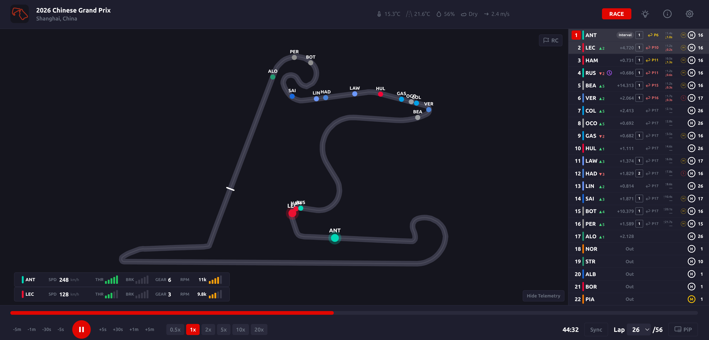

## F1 Replay Timing — Self-Hosted Installation



F1 Replay Timing is an open-source web app that lets you replay past Formula 1 sessions with real timing data, car positions on a track map, driver telemetry, weather, flags, and pit predictions. It is built with Next.js and Fast API, powered by the FastF1 Python library. Session data is automatically fetched and processed in the background on race weekends.

This guide covers installation on an existing Ubuntu 24.04 VM with Docker already installed, accessed over a local network.

Source repository: [https://github.com/adn8naiagent/F1ReplayTiming](https://github.com/adn8naiagent/F1ReplayTiming)

---

## Prerequisites

- Ubuntu 24.04 VM with Docker and Docker Compose installed
- The VM has a static LAN IP address
- Git installed on the VM
- UFW firewall active (typical on Ubuntu)

---

## Clone the Repository

SSH into your VM and clone the repo into the home directory.

```sh
git clone https://github.com/adn8naiagent/F1ReplayTiming.git && cd F1ReplayTiming
```

This downloads the source code and Dockerfiles. No pre-built binaries are included — everything is built locally from source.

---

## Configure the Compose File

The docker-compose.yml file contains two environment variables that must be set to your VM's LAN IP address before building. These values are baked into the frontend image at build time, so they must be correct before you run the build.

```sh
nano docker-compose.yml
```

Set both of these values, replacing `192.168.1.xxx` with your VM's actual static IP:

- `FRONTEND_URL=http://192.168.1.xxx:3000` — tells the backend which URL the browser uses to reach the frontend (used for CORS)
- `NEXT_PUBLIC_API_URL=http://192.168.1.xxx:8000` — tells the frontend where to find the backend API

While editing, also add `restart: unless-stopped` to both the `backend` and `frontend` service blocks, so containers automatically restart after a VM reboot.

The completed file should look like this:

```sh
cat docker-compose.yml
```

```
services:
  backend:
    build: ./backend
    restart: unless-stopped
    ports:
      - "8000:8000"
    environment:
      - FRONTEND_URL=http://192.168.1.xxx:3000
      - DATA_DIR=/data
    volumes:
      - f1data:/data
      - f1cache:/data/fastf1-cache
  frontend:
    build: ./frontend
    restart: unless-stopped
    ports:
      - "3000:3000"
    environment:
     - NEXT_PUBLIC_API_URL=http://192.168.1.xxx:8000
    depends_on:
      - backend
volumes:
  f1data:
  f1cache:
```

---

## Open Firewall Ports

UFW blocks ports 3000 and 8000 by default. Open both before building.

```sh
sudo ufw allow 3000/tcp
```

```sh
sudo ufw allow 8000/tcp
```

```sh
sudo ufw reload
```

---

## Build and Start the App

This command builds both Docker images from source and starts the containers in the background. The build will take 2-5 minutes depending on your hardware — it downloads base images, installs Python and Node.js dependencies, and compiles the Next.js frontend.

```sh
docker compose up --build -d
```

Verify both containers are running after the build completes.

```sh
docker ps
```

You should see `f1replaytiming-frontend` and `f1replaytiming-backend` both with a status of `Up`.

---

## First Run — Automatic Data Processing

On first startup, the backend automatically detects the current race weekend and begins fetching and processing session data from the F1 API. This happens in the background and can take anywhere from a few minutes to a couple of hours depending on how many sessions are available.

You can watch the processing progress in real time.

```sh
docker compose logs -f backend
```

You will see the backend fetching and saving data for each session. Each session ends with a burst of telemetry files (one per driver) followed by a `Done` message. Press Ctrl+C to stop following the logs — this does not stop the containers.

**Do not attempt to use the app in the browser while the backend is actively processing.** The backend is single-threaded during processing and cannot serve the frontend at the same time. Wait until the logs go quiet before opening the browser.

---

## Access the App

Open a browser on any device on your local network and navigate to:

```
http://192.168.1.xxx:3000
```

You will see the season calendar with all available sessions marked as AVAILABLE and upcoming rounds listed. Click any available session to load the replay.

**Important:** If you previously visited the app with a different URL (such as during troubleshooting), clear your browser cache before testing. A stale cache can cause the browser to send requests to the wrong backend URL.

---

## Rebuilding After Configuration Changes

Because `NEXT_PUBLIC_API_URL` is baked into the frontend image at compile time, any change to that value requires a full clean rebuild of the frontend image. A standard `docker compose up --build` may use cached layers and not pick up the change.

To force a complete rebuild:

```sh
docker compose down
```

```sh
docker compose build --no-cache frontend
```

```sh
docker compose up -d
```

---

## Ongoing Operation

Once running, the app is self-maintaining. The backend runs a background task that checks for new session data on race weekends (Friday through Monday) and processes it automatically. By the time you wake up after a race, the full session data will already be cached and ready to replay instantly.

Session data is stored in Docker named volumes (`f1data` and `f1cache`) and survives container restarts and rebuilds.

---

## Adding to LibreNMS Monitoring

If you use LibreNMS to monitor your homelab, add SNMP to this VM, so it can be monitored. Run the SNMP setup script if you have one, or install and configure manually.

```sh
bash ~/Scripts/setup-snmp.sh
```

Then add the VM's IP address as a new device in your LibreNMS instance.

---

## Notes

- The app processes sessions for 2024 onwards only, as stated in the project README.
- Processing a single race session takes 1-3 minutes. A full race weekend takes 3-5 minutes. A complete season takes 2-3 hours.
- The optional photo sync feature (match a replay to a live broadcast using a screenshot) requires a free API key from [https://openrouter.ai](https://openrouter.ai). Add `OPENROUTER_API_KEY=your-key-here` under the backend environment section in docker-compose.yml and rebuild.
- The app can optionally be password protected by setting `AUTH_ENABLED=true` and `AUTH_PASSPHRASE=your-passphrase` in the backend environment section.
