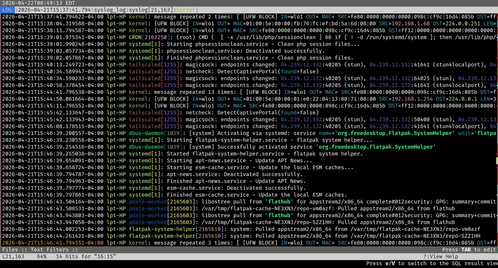

## LNav — Navigate and Analyze Log Files Like a Pro




LNav (Log File Navigator) is a terminal-based log viewer that makes navigating and analyzing Linux log files significantly easier than using standard tools like `cat` or `tail`. It colorizes output, lets you jump between errors and warnings instantly, merge multiple log files into a unified timeline, filter noise in and out, and even query logs using SQL. It is lightweight, fast, and works well even on large log files.

---

## Installation

LNav is not installed by default on most distributions. On Linux Mint and other Debian-based systems:

```sh
sudo apt install lnav
```

---

## Opening a Log File

Most system log files require `sudo` since they are owned by root. If you get a permission denied error, add `sudo` in front.

```sh
sudo lnav /var/log/syslog
```

You can open multiple log files at once and LNav will merge them into a single chronological timeline:

```sh
sudo lnav /var/log/syslog /var/log/auth.log
```

When viewing merged logs, the status bar at the top shows which file each entry belongs to as you navigate.

---

## Basic Navigation

LNav uses vi-style keybindings for movement:

| Key | Action |
|---|---|
| `j` / `k` | Scroll down / up one line |
| `g` / `G` | Jump to top / bottom |
| `e` / `E` | Jump to next / previous error |
| `w` / `W` | Jump to next / previous warning |
| `Space` | Page down |
| `q` | Quit |

Jumping directly to errors and warnings with `e` and `w` is one of LNav's most useful features — no more scrolling through thousands of lines looking for problems.

---

## Searching

Press `/` to open a search prompt at the bottom of the screen, then type your search term and press Enter:

```sh
/ssh
```

Press `n` to jump to the next match and `N` to go to the previous match. Search is case-sensitive by default.

---

## Filtering

Filtering is where LNav really earns its place in your toolkit. Press `:` to enter command mode.

Show only lines containing a term:

```sh
:filter-in sudo
```

Hide lines containing a term:

```sh
:filter-out UFW BLOCK
```

You can stack multiple filters — for example, filter out `UFW BLOCK` and then filter out `wpa_supplicant` to strip away the two biggest sources of noise in a typical laptop syslog, leaving only the system activity that actually matters.

Reset all active filters and return to the full log view:

```sh
Ctrl+R
```

---

## Tailing a Live Log

To watch a log file in real time as new entries are written, use the `-t` flag:

```sh
sudo lnav -t /var/log/syslog
```

This is the LNav equivalent of `tail -f`.

---

## Switching Views

LNav includes several views beyond the default log view. Switch between them using the command:

```sh
:switch-to-view histogram
```

Replace `histogram` with any of the following:

| View | What it shows |
|---|---|
| `log` | Default — chronological log entries |
| `histogram` | Visual summary of log activity over time, broken down by errors, warnings, and normal entries |
| `timeline` | Message count per service — useful for identifying which service is generating the most noise |
| `pretty` | Formats structured log data such as JSON into a more readable layout |

The histogram view is particularly useful for spotting spikes in activity at a glance — a sudden jump in errors or warnings at a specific time tells you exactly where to focus your investigation.

---

## SQL Queries

LNav exposes log data as a queryable database. Press `;` to enter SQL mode:

```sh
SELECT log_time, log_body FROM syslog WHERE log_body LIKE '%error%'
```

This is useful for more precise analysis than text filtering alone, especially when working with structured or high-volume logs.

---

## Recommended Log Files to Explore

These are the most useful logs to become familiar with on a Linux Mint or Debian-based system:

| Log File | What it contains |
|---|---|
| `/var/log/dpkg.log` | Package install, remove, and upgrade history — low noise, good for learning |
| `/var/log/auth.log` | Login attempts, sudo usage, PAM authentication events |
| `/var/log/syslog` | General system activity — kernel, networking, services |
| `/var/log/kern.log` | Kernel-only messages — hardware events, driver activity |
| `/var/log/apt/history.log` | High-level apt session history |

A good learning progression is to start with `dpkg.log` since it is low volume and well-structured, then move to `auth.log` for security-relevant activity, and finally `syslog` once you are comfortable filtering since it requires it.

---

## Practical Example — Stripping Syslog Noise

On a typical Linux laptop, `syslog` is dominated by firewall and Wi-Fi management entries that are normal and expected but make it hard to see anything else. Filter them out in sequence:

```sh
:filter-out UFW BLOCK
```

```sh
:filter-out wpa_supplicant
```

What remains is the actual system activity worth reading — services starting and stopping, Tailscale endpoint changes, systemd unit activity, and anything genuinely unusual.
