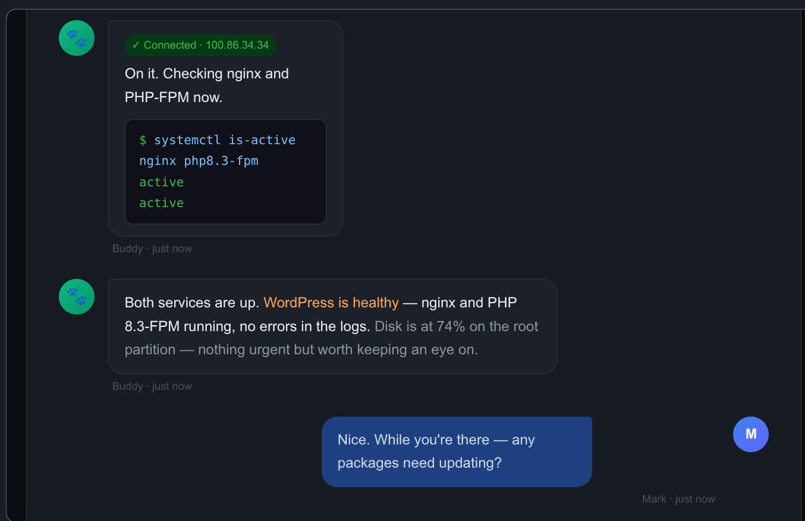

> **⚠️ IMPORTANT NOTE:** Follow the [official OpenClaw getting started guide](https://docs.openclaw.ai/start/getting-started) instead of this write-up. It is faster, is the approved installation method, and was not improvised by an AI even though the below process will get you there, eventually.

## Installing OpenClaw on a Proxmox VM

OpenClaw is an open-source AI agent that connects a large language model like Claude to messaging platforms, your filesystem, shell commands, and external APIs. Unlike a chatbot, it *acts* — running tasks autonomously while you go do something else. This guide documents installing OpenClaw 2026.4.21 on a dedicated Ubuntu 24.04 VM in Proxmox, connected to Anthropic's Claude API via Telegram.



---

## Prerequisites — Read This First

Before touching the VM, have all the following ready. Skipping any of these will stop the installation cold.

**Required before starting:**

- A dedicated Ubuntu 24.04 VM (not your daily driver — OpenClaw needs broad system access)
- An Anthropic API key from [console.anthropic.com](https://console.anthropic.com) — treat it like a password, never paste it into a chat or document
- Telegram installed on your phone with an account created
- A Telegram bot token from @BotFather (instructions in Step 7 below)
- Tailscale installed and active on the VM

**Why Telegram?** OpenClaw has no standalone browser chat interface during setup. It requires a messaging platform to function. Telegram is the simplest option — free, cross-platform, and well-supported by OpenClaw.

**Why a dedicated VM?** OpenClaw's own documentation warns that if you are not comfortable with security hardening and access control, you should not run it. An isolated VM limits the blast radius if something goes wrong.

---

## A Note About Tokens and Keys

You will end up with three separate credentials during this installation. They serve completely different purposes:

| Credential | Purpose | Where it comes from |
|---|---|---|
| Anthropic API key | Pays for Claude usage (per token) | console.anthropic.com |
| Telegram bot token | Connects OpenClaw to your Telegram bot | @BotFather in Telegram |
| OpenClaw gateway token | Authenticates you to the web UI | Generated during onboarding |

Keep all three somewhere safe. Never paste any of them into a chat window.

---

## VM Specifications

These specs provide a comfortable baseline for a personal single-user deployment:

| Resource | Value |
|---|---|
| OS | Ubuntu 24.04 LTS |
| vCPUs | 2 |
| RAM | 4 GB |
| Disk | 40 GB |

---

## Step 1 — Provision and Update the VM

Spin up the VM from your Ubuntu 24.04 template in Proxmox. Fix the hostname and assign a static IP before anything else, then install Tailscale.

Once SSH'd in, update the system:

```sh
sudo apt update && sudo apt upgrade -y
```

---

## Step 2 — Switch to Bash

**This is mandatory.** All OpenClaw commands must be run in bash. If you use Fish shell, OpenClaw's pnpm environment variables will not be set correctly and commands will fail with confusing errors.

If your terminal opens in Fish, switch to bash before doing anything else:

```sh
bash
```

Stay in bash for the entire installation and for all future OpenClaw operations.

---

## Step 3 — Install Node.js 22

Ubuntu's default repositories ship an outdated version of Node.js. OpenClaw requires Node 22 or higher. Install from NodeSource:

```sh
curl -fsSL https://deb.nodesource.com/setup_22.x | sudo -E bash -
```

```sh
sudo apt install nodejs -y
```

Verify:

```sh
node --version
```

Expected output: `v22.x.x`

---

## Step 4 — Install pnpm

OpenClaw 2026.4.x has a known bug where installing via `npm` silently omits channel plugin dependencies, causing cascading crashes during onboarding. Use `pnpm` instead — do not use `npm install -g openclaw` regardless of what other guides say.

Install pnpm:

```sh
sudo npm install -g pnpm
```

Configure pnpm's home directory:

```sh
pnpm setup
```

Load the new configuration:

```sh
source ~/.bashrc
```

---

## Step 5 — Install OpenClaw

```sh
pnpm add -g openclaw@latest
```

When prompted to approve build scripts:

```sh
pnpm approve-builds -g
```

Press `a` to select all, then `y` to confirm. This allows native dependencies to compile for your system.

Verify:

```sh
openclaw --version
```

---

## Step 6 — Install Missing Channel Plugin Dependencies

Even with pnpm, OpenClaw 2026.4.x does not stage all channel plugin dependencies correctly. This is a known open bug. Install them all at once before running onboarding — otherwise they crash the wizard one at a time:

```sh
pnpm add -g @larksuiteoapi/node-sdk grammy @grammyjs/runner @grammyjs/transformer-throttler @whiskeysockets/baileys @slack/web-api @slack/bolt @buape/carbon discord-api-types @discordjs/voice nostr-tools
```

---

## Step 7 — Create a Telegram Bot

1. Install Telegram on your phone and create an account
2. Search for **@BotFather** and open a chat
3. Send `/newbot`
4. Follow the prompts — give your bot a name and a username
5. Copy the token BotFather provides — it looks like `123456789:ABCdef...`

Have this token ready before starting onboarding.

---

## Step 8 — Run Onboarding

```sh
openclaw onboard --install-daemon
```

Work through the wizard in this order:

- **Security disclaimer** → Yes
- **Setup mode** → QuickStart
- **Model/auth provider** → Anthropic (Claude CLI + API key)
- **Anthropic auth method** → Anthropic API key
- **Enter API key** → type your key directly in the terminal
- **Default model** → `anthropic/claude-sonnet-4-6` (do not select Opus — it costs significantly more)
- **Web search** → Skip for now
- **Select channel** → Telegram (Bot API)
- **Bot token** → Enter Telegram bot token → paste your BotFather token
- **Configure skills** → No
- **Hooks** → Skip for now

The wizard installs a systemd user service and enables lingering, so the gateway keeps running after you log out.

At the end of onboarding you will see a Control UI URL with a token embedded:

```
http://127.0.0.1:18789/#token=YOUR_TOKEN_HERE
```

**Save this token.** You will need it to access the web UI.

---

## Step 9 — Start the Gateway

```sh
openclaw gateway start
```

Verify it is running:

```sh
openclaw gateway status
```

Look for `Runtime: running` and `Connectivity probe: ok`.

---

## ⚠️ Step 9a — Understand and Control the Heartbeat

**Read this carefully before installing any skills.**

OpenClaw has a heartbeat system that can run periodic agent turns automatically. Each heartbeat loads your entire workspace context — SOUL.md, USER.md, TOOLS.md, AGENTS.md, and any installed skills — and sends it to the Claude API. This costs real money every time it fires.

**What we know from direct experience:** Installing the self-improving skill from ClawHub triggered aggressive heartbeat activity. The estimated cost was approximately $0.50 per hour — over $18 in 36 hours — running unattended. The heartbeat may not run at all out of the box, but certain skills enable or accelerate it automatically when installed.

**The safe approach:** Explicitly set the heartbeat interval to zero immediately after setup, before installing any skills. This guarantees it cannot run without your knowledge regardless of what any skill does.

```sh
openclaw config set agents.defaults.heartbeat.every "0m"
```

Restart the gateway to apply:

```sh
openclaw gateway restart
```

Before installing any skill from ClawHub, ask: does this skill run on a schedule or only when I ask? If it runs on a schedule, understand the token cost before enabling it. Never install background or self-improving skills without first setting a spend limit in the Anthropic console.

---

## Step 10 — Pair Your Telegram Account

Open Telegram on your phone and send any message to your bot. It will respond with a pairing code.

Back on the VM in bash, approve yourself:

```sh
openclaw pairing approve telegram CODE
```

Replace `CODE` with the code shown in Telegram. Your bot will confirm and start responding normally.

---

## Step 11 — Lock Down DM Access

By default, any Telegram user who finds your bot can send it a pairing request. Lock it to your Telegram ID only.

Your Telegram user ID was shown in the pairing screen when you first messaged the bot. You can also ask the bot directly: "what is my Telegram user ID?"

```sh
openclaw config set channels.telegram.dmPolicy "allowlist"
```

```sh
openclaw config set channels.telegram.allowFrom '["YOUR_TELEGRAM_USER_ID"]'
```

Restart the gateway to apply:

```sh
openclaw gateway restart
```

---

## Step 12 — Run the Security Audit

```sh
openclaw security audit --deep
```

```sh
openclaw security audit --fix
```

**What to expect on a clean personal install:**

The audit will report 0 critical issues. Here is what matters and what you can ignore:

| Warning | Action |
|---|---|
| `gateway.control_ui.insecure_auth` | Fix this — disable it (see below) |
| `config.insecure_or_dangerous_flags` | Same fix as above |
| `gateway.trusted_proxies_missing` | Ignore — only relevant if using a reverse proxy |
| `gateway.nodes.deny_commands_ineffective` | Ignore — refers to iOS/Android node commands |
| `security.trust_model.multi_user_heuristic` | Ignore — expected on a personal single-user setup |

Disable the insecure auth flag:

```sh
openclaw config set gateway.controlUi.allowInsecureAuth false
```

Restart to apply:

```sh
openclaw gateway restart
```

---

## Step 13 — Set Up Tailscale Serve for Web UI Access

The gateway binds to loopback only (127.0.0.1) by design — it will not respond to direct IP connections on your network. Tailscale Serve is the cleanest way to access the web UI from any device on your tailnet over HTTPS without an SSH tunnel.

First, grant your user operator permission, so you do not need sudo for Tailscale commands:

```sh
sudo tailscale set --operator=$USER
```

Then enable Tailscale Serve pointed at the gateway:

```sh
tailscale serve --bg http://127.0.0.1:18789
```

This outputs your persistent Tailscale HTTPS URL — it will look like:

```
https://openclaw-vm.tailXXXXX.ts.net/
```

Save that URL. Now tell OpenClaw to trust it as an allowed origin:

```sh
openclaw config set gateway.controlUi.allowedOrigins '["https://openclaw-vm.tailXXXXX.ts.net"]' --strict-json
```

Restart the gateway:

```sh
openclaw gateway restart
```

---

## Step 14 — Access the Web UI

Open your Tailscale URL in a browser:

```
https://openclaw-vm.tailXXXXX.ts.net/
```

Get your tokenized dashboard URL from the VM:

```sh
openclaw dashboard
```

Take the token from that output and open:

```
https://openclaw-vm.tailXXXXX.ts.net/#token=YOUR_TOKEN_HERE
```

The first time you connect from a new browser, OpenClaw will require device pairing approval. You will see a request ID on screen. Approve it from the VM:

```sh
openclaw devices approve REQUEST_ID_HERE
```

Once approved, that browser is remembered and will not need re-approval unless revoked.

The web UI gives you a full dashboard for chatting with the agent, managing sessions, reviewing logs, configuring channels, and managing cron jobs — all from your browser.

---

## Monitoring API Costs

OpenClaw uses your Anthropic API key on a pay-per-use basis. Every message the agent processes costs tokens. Monitor your spending at [console.anthropic.com](https://console.anthropic.com) → Usage. Check this daily during your first week.

**Important — heartbeat cost:** OpenClaw runs a heartbeat check every 30 minutes by default. Each heartbeat is a full agent turn that consumes API tokens even when you are not actively using the bot. To disable heartbeats:

```sh
openclaw config set agents.defaults.heartbeat.every "0m"
```

Estimated monthly costs with claude-sonnet-4-6:

| Usage level | Typical tasks | Estimated cost |
|---|---|---|
| Light | Daily briefings, occasional questions | $5–$15/month |
| Medium | File management, coding assistance | $20–$50/month |
| Heavy | Multi-step automation, frequent loops | $50–$150+/month |

---

## Workspace Files — Personalizing the Agent

OpenClaw automatically creates a set of markdown files in `~/.openclaw/workspace/` on first run. These files are injected into every agent session and define who the agent is and what it knows about you.

| File | Purpose |
|---|---|
| `SOUL.md` | Agent personality, tone, and behavioral boundaries |
| `AGENTS.md` | Procedural rules — what the agent does and how |
| `USER.md` | Context about you — timezone, background, preferences |
| `TOOLS.md` | Notes about available tools and your specific setup |
| `HEARTBEAT.md` | Tasks the agent checks on every 30-minute heartbeat |
| `MEMORY.md` | Long-term memory — created and maintained by the agent |

Edit these files with any text editor. Changes take effect on the next agent session. Start with `USER.md` — it has the most immediate impact since it tells the agent who you are before your first message.

The workspace is auto-initialized as a git repo if git is installed. Keep it that way — it gives you a rollback path if workspace changes break behavior.

---

## Known Issues — OpenClaw 2026.4.x

**Missing channel plugin dependencies:** A build pipeline bug causes both `npm` and `pnpm` global installs to omit channel plugin runtime dependencies. The manual `pnpm add -g` command in Step 6 is the workaround. This is a known open issue being actively worked on.

**Do not use `npm install -g openclaw`:** Despite appearing in many guides and the npm page, this install method is broken for 2026.4.x. Use pnpm only.

**Fish shell incompatibility:** OpenClaw's pnpm environment does not load correctly in Fish shell. Always run OpenClaw commands in bash.

**`allowInsecureAuth` enabled by default:** This flag is set to true during onboarding. Disable it immediately after setup as shown in Step 12.

**API key security:** If your Anthropic API key is ever exposed, revoke it immediately at [console.anthropic.com](https://console.anthropic.com) and generate a new one before continuing.

---

## Next Steps

Once the agent is running and secured:

1. Review the auto-generated files in `~/.openclaw/workspace/`
2. Edit `USER.md` to give the agent context about your homelab and routines
3. Edit `SOUL.md` to give the agent a name and personality
4. Start simple — ask it to check disk usage, summarize a log file, or do a web search
5. Browse ClawHub for skills — install only what you actually need, one at a time
6. Verify behavior carefully before granting access to sensitive files or other machines on your network

---

## Giving Buddy Access to Other VMs

Buddy can SSH into other VMs on your network to run commands, check services, update packages, and manage files. Each VM requires the same two-step setup.

**Step 1 — Copy the SSH public key from openclaw-vm to the target VM:**

```sh
ssh-copy-id mark@TARGET_VM_IP
```

Run this from openclaw-vm. Use the Tailscale IP of the target VM for consistency.

**Step 2 — Tell Buddy the Tailscale IP of the VM.**

Send him a message like: "You now have SSH access to [vm-name] at [tailscale-ip]. Please connect and map the setup, then update TOOLS.md with what you find."

He will handle the rest and document it himself.

---

## Passwordless Sudo on Target VMs

For Buddy to run system-level commands (package updates, service restarts, etc.) without being prompted for a password, you need to grant passwordless sudo to your user on each VM where you want that capability.

On the target VM, run:

```sh
sudo visudo
```

Add this line at the end, replacing `mark` with your username:

```sh
mark ALL=(ALL) NOPASSWD: ALL
```

> **Security note:** This grants broad sudo access without a password. Only do this on VMs that Buddy has SSH access to, and only after you are comfortable with how Buddy behaves. Start with one VM, verify behavior, then expand.

---

## TOOLS.md — Keeping Buddy's VM Knowledge Current

Every time you give Buddy access to a new VM, ask him to update `~/.openclaw/workspace/TOOLS.md` with what he finds. This file is injected into every session, so it is how Buddy remembers which machines he can reach and what is running on them.

After connecting a new VM, send Buddy:

> Please update TOOLS.md with everything you just learned about [vm-name] — its Tailscale IP, what's installed, how the key services are configured, and any quirks worth remembering.

---

## End of Session Discipline

Buddy has no persistent memory between sessions beyond what is written to his workspace files. To avoid losing context, end each working session by sending him:

> Please update your memory files with anything important from this session — what we did, what changed, and anything you learned about my setup.

This keeps MEMORY.md, TOOLS.md, and USER.md current and ensures the next session picks up where this one left off.
