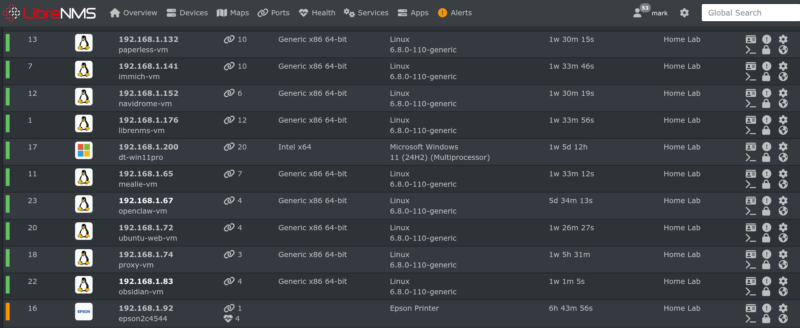

See [Setting up LibreNMS and SNMP clients](2025-06-01-LibreNMS-Install-on-Ubuntu-VM-with-Docker.md) for the full setup.


A complete walkthrough for deploying the SNMP client to a new VM and adding it to LibreNMS for monitoring. Starting point assumes `setup-snmp.sh` exists at `~/Scripts/` on lpt-HP only.



---

## Prerequisites

- `setup-snmp.sh` present at `~/Scripts/` on lpt-HP (192.168.1.100)
- SSH access from lpt-HP to the target VM
- `~/Scripts/` directory already exists on the target VM
- LibreNMS running on librenms-vm (192.168.1.176)
- Target VM has a known static IP address

---

## Step 1 — Copy the Script to the Target VM

From lpt-HP, copy the script to the target VM. Replace `<IP>` with the target VM's IP address.

```sh
scp ~/Scripts/setup-snmp.sh mark@<IP>:~/Scripts/
```

No output means success. The filename echoed back confirms the copy completed.

---

## Step 2 — SSH into the Target VM

```sh
ssh mark@<IP>
```

---

## Step 3 — Make the Script Executable and Run It

```sh
chmod +x ~/Scripts/setup-snmp.sh && ~/Scripts/setup-snmp.sh
```

The script installs `snmpd`, writes the configuration file, restarts and enables the service on boot, and opens UFW port 161 if UFW is active. The final line may show `snmpwalk: command not found` — this is expected and harmless. The SNMP service is running correctly regardless.

---

## Step 4 — Exit Back to lpt-HP

```sh
exit
```

---

## Step 5 — Verify SNMP Reachability from LibreNMS

SSH into librenms-vm:

```sh
ssh mark@192.168.1.176
```

Run a test poll against the new VM:

```sh
docker exec -it librenms snmpwalk -v2c -c public <IP> system
```

A successful response returns a block of `SNMPv2-MIB::sys*` entries. If you get a timeout instead, verify `snmpd` is running on the target VM and that UFW is not blocking UDP port 161 before continuing.

Exit librenms-vm:

```sh
exit
```

---

## Step 6 — Add the Device in LibreNMS

Open the LibreNMS web UI at `192.168.1.176:8000` and navigate to **Devices → Add Device**.

Enter the following values:

- **Hostname/IP:** `<IP>`
- **SNMP version:** `v2c`
- **Community:** `public`

Click **Add Device**. LibreNMS confirms with a message like:

```sh
Adding host <IP> community public port using udp
Device added [<IP>]
```

LibreNMS begins polling immediately. Memory, system info, and interface data should populate within seconds, confirming SNMP is fully operational.
