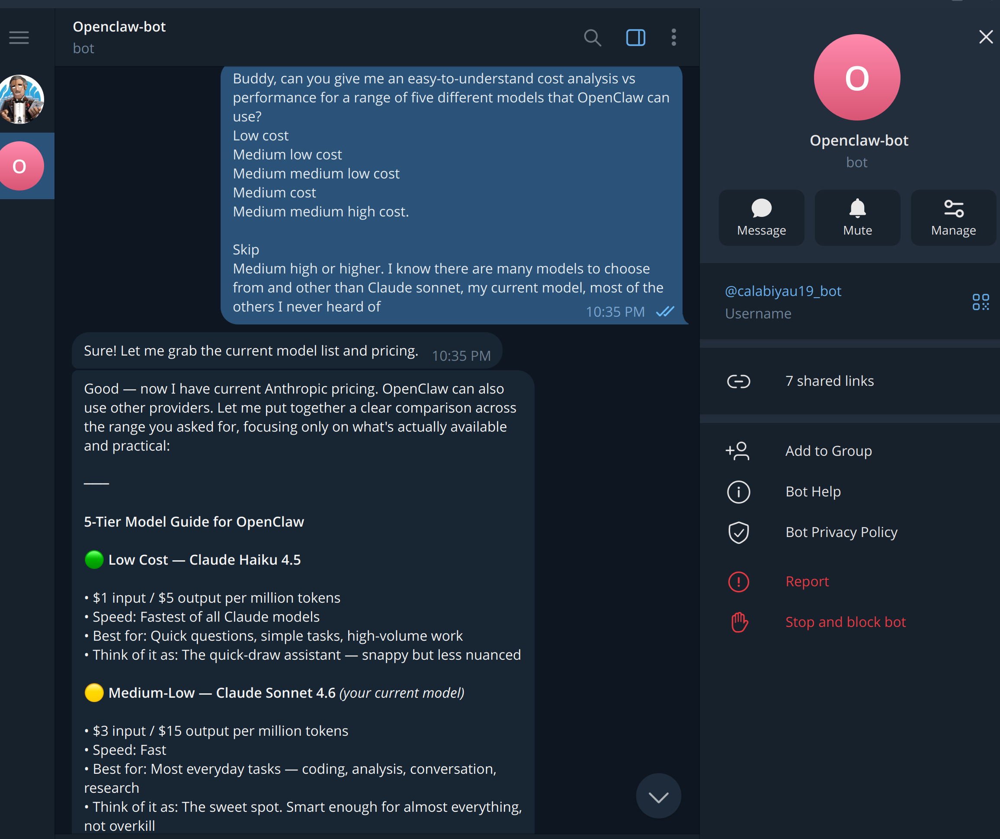

## Installing Telegram Desktop on Linux Mint 22.2

Linux Mint 22.x no longer ships a Telegram package in its default repositories, and the Flatpak version from the Software Manager has a known cursor rendering bug on Cinnamon. The correct approach is to install the official binary directly from Telegram's website.

<!-- Hero image suggestion: Telegram desktop app open on Linux Mint Cinnamon desktop -->

---

## Why Not the Software Manager Version?

The Flatpak version of Telegram available in the Linux Mint Software Manager causes an inconsistent mouse cursor — the system cursor is replaced with a small default cursor inside the Telegram window. This is a known upstream issue with the Flatpak packaging and is not fixed by permission overrides. The official binary from Telegram's website does not have this problem.

---

## Step 1 — Remove the Flatpak Version (if installed)

If you previously installed Telegram from the Software Manager:

```sh
flatpak uninstall org.telegram.desktop
```

---

## Step 2 — Download the Official Binary

Go to [https://desktop.telegram.org](https://desktop.telegram.org) in your browser and download the Linux tarball. It will land in your Downloads folder as a file named something like `tsetup.6.7.8.tar.xz`.

---

## Step 3 — Extract the Archive

```sh
tar -xf ~/Downloads/tsetup.*.tar.xz -C ~/Downloads/
```

---

## Step 4 — Move to /opt

```sh
sudo mv ~/Downloads/Telegram /opt/telegram
```

---

## Step 5 — Create a Symlink

This allows you to launch Telegram from the terminal:

```sh
sudo ln -sf /opt/telegram/Telegram /usr/local/bin/telegram
```

---

## Step 6 — Add to the Application Menu

Create a desktop entry, so Telegram appears in the Cinnamon application menu:

```sh
sudo nano /usr/share/applications/telegram.desktop
```

Paste the following:

```
[Desktop Entry]
Name=Telegram
Comment=Telegram Desktop
Exec=/opt/telegram/Telegram
Icon=/opt/telegram/telegram.png
Terminal=false
Type=Application
Categories=Network;InstantMessaging;
```

Save with Ctrl+X, then Y, then Enter.

---

## Step 7 — Launch and Log In

Search for Telegram in your application menu or run:

```sh
telegram
```

Log in with your phone number. If you already have Telegram on another device, all your conversations including any bots will sync automatically — no additional setup required.

---

## Updating Telegram

The official binary includes a built-in auto-updater. Telegram will notify you when a new version is available and update itself. No package manager commands needed.
