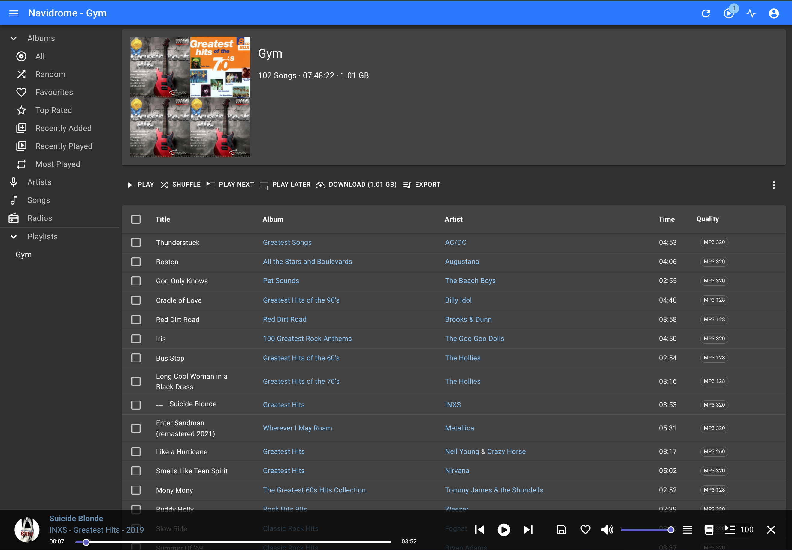

## Navidrome Music Server — Docker Setup with Optional External NFS Music Library

*Hero image suggestion: A screenshot of the Navidrome web UI showing an album grid, placed here to give the reader a visual target for what a working install looks like.*

This guide covers the complete setup of Navidrome as a self-hosted music streaming server running inside Docker on an Ubuntu 24.04 VM hosted on Proxmox. It assumes Docker and Docker Compose are already installed and tested, and that your user account has been added to the `docker` group.

The guide is split into two parts:

- **Part 1** — Install and verify Navidrome using a local test music file
- **Part 2** — Connect Navidrome to an external music library stored on a USB SSD attached to the Proxmox host via NFS

Part 2 is completely optional. If your music is stored locally on the VM, you can stop after Part 1 and update the music volume path in your `docker-compose.yml` to point wherever your files live.

---

## Part 1 — Install and Verify Navidrome

### Create the Directory Structure

```sh
mkdir -p ~/navidrome/{config,music}
```

This creates two subdirectories under `~/navidrome`: one for Navidrome's internal config and database, and one for music files.

### Download a Test MP3

```sh
wget -O ~/navidrome/music/test.mp3 https://www.soundhelix.com/examples/mp3/SoundHelix-Song-1.mp3
```

A small test file to confirm Navidrome can scan and stream before connecting real music.

### Create the Docker Compose File

```sh
nano ~/navidrome/docker-compose.yml
```

Paste in the following:

```sh
services:
  navidrome:
    image: deluan/navidrome:latest
    container_name: navidrome
    user: 1000:1000
    ports:
      - "4533:4533"
    restart: unless-stopped
    volumes:
      - "${HOME}/navidrome/config:/data"
      - "${HOME}/navidrome/music:/music:ro"
```

Save and exit with `Ctrl+O`, `Enter`, `Ctrl+X`.

The `user: 1000:1000` line sets the UID and GID the container runs as. Confirm yours with `id -u` and `id -g` before proceeding — both should return `1000` on a standard Ubuntu install. If they differ, update that line accordingly.

Music is mounted read-only (`ro`) — Navidrome never needs write access to your library.

### Start the Container

```sh
cd ~/navidrome && docker compose up -d
```

Docker will pull the image on first run. Subsequent starts are near-instant.

### Verify in the Browser

Open `http://<your-vm-ip>:4533` in a browser. You should see the Navidrome login screen. Log in with `admin` / `admin` — you will be prompted to set a new password immediately. Your test MP3 should appear under Songs within a few seconds as Navidrome completes its first scan.

---

## Part 2 — Connect an External Music Library via NFS

This section connects Navidrome to a music collection stored on a USB SSD attached directly to the Proxmox host. The VM accesses the drive over NFS. If this does not apply to your setup, stop here and update the music volume path in your `docker-compose.yml` to point to wherever your music lives on the VM.

The steps below are split by which machine you are working on. Read each section header carefully before running any commands.

---

### On the Proxmox Host — Prepare the USB SSD

*Skip this section if your SSD is already formatted, mounted, and has a music folder.*

#### Identify the new drive

```sh
lsblk
```

Look for a device around 2TB with no mount point — it will appear as `/dev/sdX`. Replace `sdX` with the actual device letter in every command that follows.

#### Partition the drive

```sh
sudo parted /dev/sdX --script mklabel gpt mkpart primary ext4 0% 100%
```

Creates a single GPT partition spanning the full drive.

#### Format the partition

```sh
sudo mkfs.ext4 /dev/sdX1
```

Formats the partition as ext4.

#### Create the mount point

```sh
sudo mkdir -p /mnt/Ext_New_SSD
```

#### Mount the drive

```sh
sudo mount /dev/sdX1 /mnt/Ext_New_SSD
```

#### Make the mount persistent across reboots

```sh
sudo blkid
```

Copy the UUID value for `/dev/sdX1`, then open fstab:

```sh
sudo nano /etc/fstab
```

Add this line at the bottom, replacing `UUID=xxxxx` with the value you copied:

```sh
UUID=xxxxx /mnt/Ext_New_SSD ext4 defaults 0 2
```

Test it:

```sh
sudo mount -a
```

No output means success.

#### Create the music folder and set permissions

```sh
sudo mkdir -p /mnt/Ext_New_SSD/music
```

```sh
sudo chown root:root /mnt/Ext_New_SSD/music
```

```sh
sudo chmod 755 /mnt/Ext_New_SSD/music
```

---

### On the Proxmox Host — Export the Music Folder via NFS

#### Install NFS server if not already present

```sh
sudo apt update && sudo apt install nfs-kernel-server
```

If it reports `nfs-kernel-server is already the newest version`, continue.

#### Add the NFS export

```sh
sudo nano /etc/exports
```

Add this line at the bottom:

```sh
/mnt/Ext_New_SSD/music 192.168.1.0/24(ro,sync,no_subtree_check)
```

Adjust the subnet if your network range is different. `ro` means the clients can read but not write.

#### Apply the export

```sh
sudo exportfs -ra
```

#### Verify the export is active

```sh
sudo exportfs -v
```

You should see your path listed with the subnet and options. If nothing appears, the export did not register — re-check `/etc/exports` for typos.

---

### On the Ubuntu VM — Mount the NFS Share

All remaining commands run on the VM where Navidrome is installed, not on the Proxmox host.

#### Install NFS client

```sh
sudo apt update && sudo apt install nfs-common
```

#### Create the mount point

```sh
sudo mkdir -p /mnt/navidrome/music
```

#### Confirm the Proxmox host is offering the export

```sh
showmount -e 192.168.1.125
```

Expected output:

```sh
Export list for 192.168.1.125:
/mnt/Ext_New_SSD/music 192.168.1.0/24
```

If this hangs or errors, the NFS server on the Proxmox host is not reachable. Go back and verify `exportfs -v` output on the host before continuing.

#### Mount the NFS share

```sh
sudo mount -t nfs 192.168.1.125:/mnt/Ext_New_SSD/music /mnt/navidrome/music
```

#### Verify the music is visible

```sh
ls -lah /mnt/navidrome/music
```

Your music folders should appear. If the directory is empty, the NFS share mounted but the path on the Proxmox host is wrong — re-check the export path.

#### Make the mount persistent across reboots

This step is mandatory. Without it, the mount will disappear after every reboot and Navidrome will show all songs as missing.

```sh
sudo nano /etc/fstab
```

Add this line at the bottom:

```sh
192.168.1.125:/mnt/Ext_New_SSD/music /mnt/navidrome/music nfs ro,nofail,x-systemd.automount,_netdev 0 0
```

The `_netdev` flag tells the system to wait for the network before attempting this mount. The `nofail` flag prevents a failed mount from blocking boot.

Test it:

```sh
sudo mount -a
```

No output means success.

---

### On the Ubuntu VM — Update Navidrome to Use the NFS Path

#### Update docker-compose.yml

```sh
nano ~/navidrome/docker-compose.yml
```

Update the volumes section to point to the NFS mount:

```sh
    volumes:
      - "${HOME}/navidrome/config:/data"
      - "/mnt/navidrome/music:/music:ro"
```

#### Restart Navidrome

```sh
cd ~/navidrome && docker compose down && docker compose up -d
```

Open the Navidrome web UI at `http://<your-vm-ip>:4533`. Your full music library should begin appearing within seconds as Navidrome scans the NFS-mounted folder.

---

## Recovery — NFS Mount Lost After Reboot

If Navidrome shows all songs as missing after a VM reboot and the fstab entry is not yet in place, run these three commands on the VM in order:

```sh
sudo mount -t nfs 192.168.1.125:/mnt/Ext_New_SSD/music /mnt/navidrome/music
```

```sh
ls -lah /mnt/navidrome/music
```

Confirm your music folders are visible, then restart Navidrome:

```sh
cd ~/navidrome && docker compose down && docker compose up -d
```

Then add the fstab entry above so this does not happen again.
