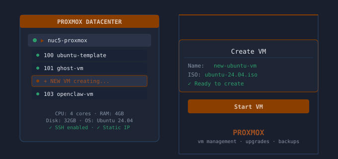
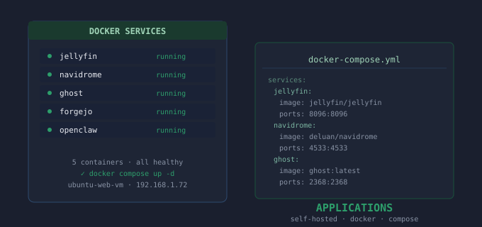
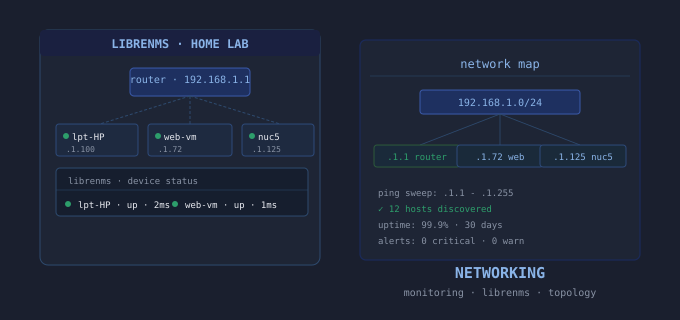
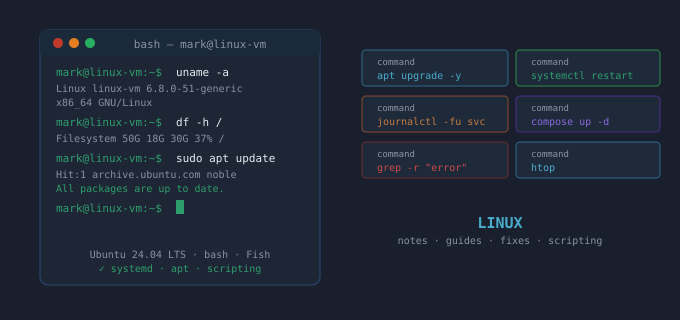
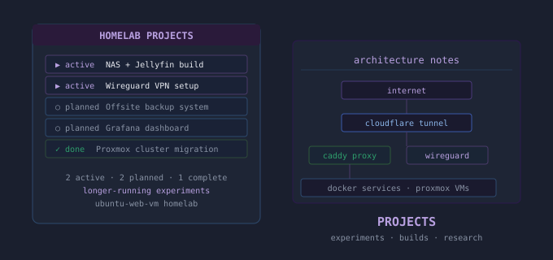
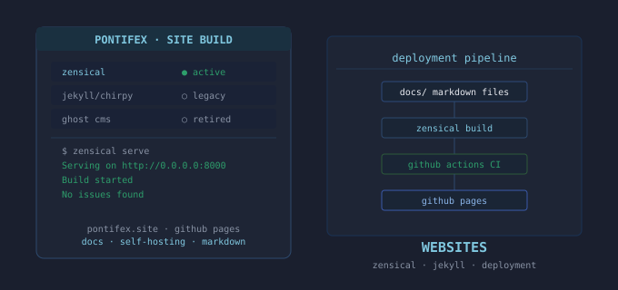

Personal documentation for homelab projects — Proxmox, self-hosted applications, Linux, and networking. Built from real-world experience running a home server environment on Ubuntu and Proxmox. **September 2026:** migrated from Jekyll to [Zensical](https://zensical.org), the new static site generator from the team behind Material for MkDocs.

-   :simple-proxmox:{ .lg .middle } __Proxmox__

    ---
    

    VM management, upgrades, cloning, and backup strategies for Proxmox VE

    <!-- [:octicons-arrow-right-24: Proxmox guides](proxmox/index.md) -->

-   :material-application:{ .lg .middle } __Applications__

    ---
    

    Self-hosted app installs — Jellyfin, Navidrome, Ghost, Forgejo, and more

    <!-- [:octicons-arrow-right-24: Application guides](applications/2026-02-06-forgejo-git-gui-setup.md) -->

-   :material-network:{ .lg .middle } __Networking__

    ---
    

    Home lab network monitoring and configuration

    <!-- [:octicons-arrow-right-24: Networking guides](networking/2026-04-27-adding-vm-to-librenms.md) -->

-   :fontawesome-brands-linux:{ .lg .middle } __Linux__

    ---
    
    
    Linux tools, utilities, and workflows for Ubuntu and Linux Mint

    <!-- [:octicons-arrow-right-24: Linux guides](linux/2026-01-21-rsync-external-backup-guide.md) -->

-   :material-wrench:{ .lg .middle } __Projects__

    ---
    

    Longer-running homelab projects and experiments

    <!-- [:octicons-arrow-right-24: Projects](projects/2026-01-26-obsidian-syncthing-piano-setup-documentation.md) -->

-   :material-web:{ .lg .middle } __Websites__

    ---
    

    Documentation on building and running this site

    <!-- [:octicons-arrow-right-24: Website guides](websites/2025-02-26-Create-and-Deploy-A-Jekyll%20Site-On-GitHub-Pages.md) -->

