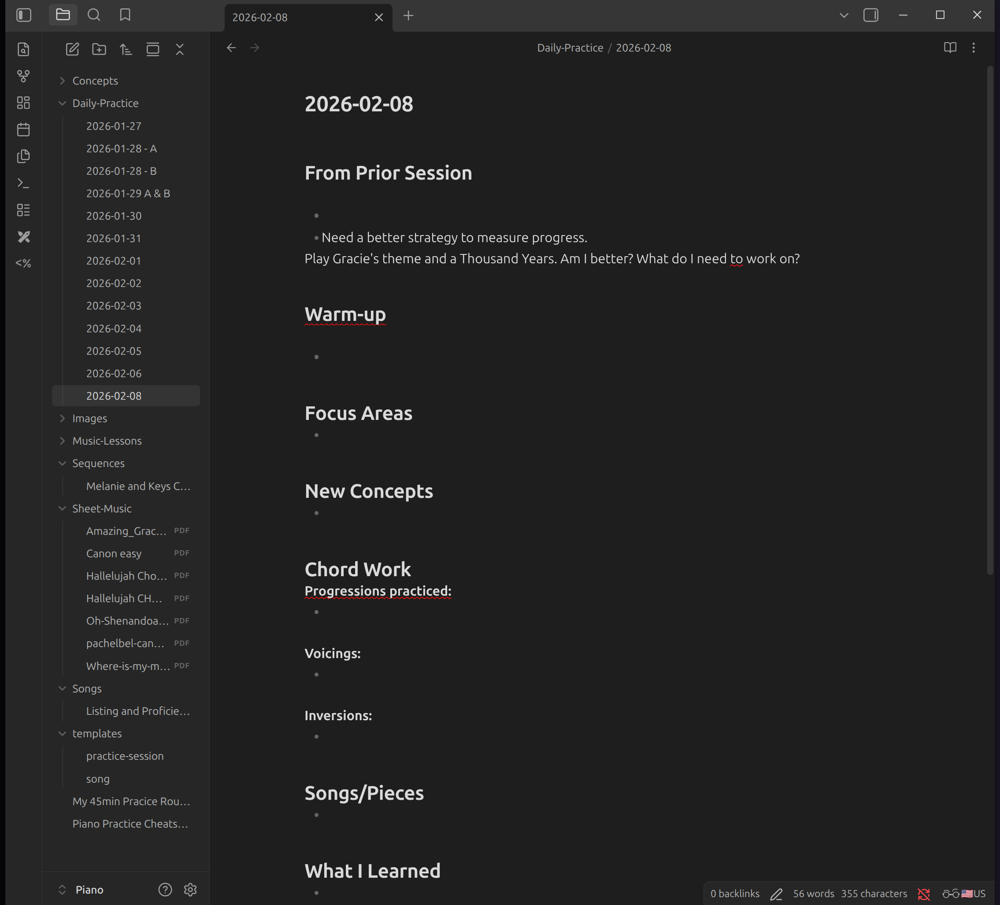

## Obsidian Piano Learning System Documentation

**Created:** January 27, 2026
**System:** Obsidian with Sync thing for cross-device sync  
**Devices:** Linux Mint laptop (lpt-hp), Ubuntu VM (obsidian-vm at 192.168.1.83), iOS (planned)

---




## Table of Contents
1. [System Overview](#system-overview)
2. [Why Syncthing vs Rsync](#why-syncthing-vs-rsync)
3. [Current Setup](#current-setup)
4. [Vault Structure](#vault-structure)
5. [Templates](#templates)
6. [Next Steps](#next-steps)
7. [Troubleshooting](#troubleshooting)


---

## System Overview

This system provides a comprehensive documentation platform for piano learning that syncs across devices:
- **Linux Mint laptop:** Primary note-taking and practice documentation
- **Ubuntu VM (obsidian-vm):** Central sync hub running Syncthing in Docker
- **iOS devices:** Mobile access for practice session notes (pending setup)

The vault contains structured folders for daily practice logs, music theory concepts, lesson notes, song analysis, and sheet music.

---

## Why Syncthing vs Rsync

**Rsync** is designed for **one-way backups** - pushing data from source to destination on a schedule (like your Samsung T7 backups).

**Syncthing** provides **two-way, real-time sync** needed for this workflow:
- Write practice notes on iPad/iPhone at the piano
- Review and expand those notes on laptop
- Reference notes on phone while at piano
- **All devices need to both read AND write**, staying in sync automatically

Rsync cannot do this - it's unidirectional and requires manual execution. Syncthing watches for changes on all devices, syncs bidirectionally in real-time, and handles conflicts automatically.

**Think of it as:**
- Rsync = scheduled backup truck (one direction, on schedule)
- Syncthing = self-hosted Dropbox (bidirectional, real-time, on your infrastructure)

---

## Current Setup

### Network Configuration
```
Linux Mint Laptop (lpt-hp)
    <--> Syncthing sync
Ubuntu VM (obsidian-vm)
    - IP: 192.168.1.83
    - Tailscale IP: 100.78.230.66
    - Docker container running Syncthing
    <--> Syncthing sync (planned)
iOS devices
    - Will connect via Mobius Sync app
    - Uses Tailscale IP for secure connection
```

### Docker Configuration (obsidian-vm)

**Location:** `/home/mark/syncthing/docker-compose.yml`

```yaml
services:
  syncthing:
    image: syncthing/syncthing:latest
    container_name: syncthing
    hostname: obsidian-vm
    environment:
      - PUID=1000
      - PGID=1000
    volumes:
      - ./config:/var/syncthing/config
      - ./vault:/var/syncthing
    network_mode: host
    restart: unless-stopped
```

**Key points:**
- `network_mode: host` enables proper local device discovery (recommended by Syncthing official docs)
- Volume mapping: `./vault:/var/syncthing` means files in container's `/var/syncthing` are stored at `/home/mark/syncthing/vault/` on VM
- `restart: unless-stopped` ensures Syncthing starts automatically after VM reboots

### File Paths

**Laptop:**
- Vault location: `/home/mark/Piano/`
- Syncthing config: `~/.config/syncthing/`
- Syncthing runs as systemd user service

**VM (obsidian-vm):**
- Container path: `/var/syncthing/Piano/` (inside Docker container)
- Actual filesystem: `/home/mark/syncthing/vault/Piano/` (on VM)
- Accessible via: `sftp://192.168.1.83/home/mark/syncthing/vault/`

---

## Installation Steps

### Part 1: Install Tailscale on VM

**Why first:** Tailscale provides the secure connection that iOS will use to reach the VM.

1. SSH into obsidian-vm (192.168.1.83)

2. Install Tailscale:
```sh
curl -fsSL https://pkgs.tailscale.com/stable/ubuntu/noble.noarmor.gpg | sudo tee /usr/share/keyrings/tailscale-archive-keyring.gpg >/dev/null
curl -fsSL https://pkgs.tailscale.com/stable/ubuntu/noble.tailscale-list | sudo tee /etc/apt/sources.list.d/tailscale.list
sudo apt update
sudo apt install tailscale
```

3. Start and authenticate Tailscale:
```sh
sudo tailscale up
```
   - This will give you a URL to authenticate in your browser
   - Complete authentication

4. Verify and get Tailscale IP:
```sh
tailscale ip -4
```
   - **Result:** 100.78.230.66 (save this for iOS setup later)

5. Set hostname (optional but recommended):
```sh
sudo tailscale set --hostname obsidian-vm
```

6. Enable on boot:
```sh
sudo systemctl enable tailscaled
```

### Part 2: Install Syncthing on VM (Docker)

**Why Docker:** Keeps Syncthing isolated and easy to manage/update.

1. Still SSH'd into obsidian-vm, create directories:
```sh
mkdir -p ~/syncthing/{config,vault}
cd ~/syncthing
```

2. Create docker-compose.yml:
```sh
nano docker-compose.yml
```

3. Paste this content (based on official Syncthing Docker documentation):
```yaml
services:
  syncthing:
    image: syncthing/syncthing:latest
    container_name: syncthing
    hostname: obsidian-vm
    environment:
      - PUID=1000
      - PGID=1000
    volumes:
      - ./config:/var/syncthing/config
      - ./vault:/var/syncthing
    network_mode: host
    restart: unless-stopped
```
   - Save: `Ctrl+O`, `Enter`, `Ctrl+X`
   - **Note:** `network_mode: host` is recommended by Syncthing for proper device discovery

4. Start Syncthing:
```sh
docker compose up -d
```

5. Verify it's running:
```sh
docker ps
```
   - Should show syncthing container with status "Up"

6. Access web UI from your laptop browser:
   - Go to: http://192.168.1.83:8384

7. Set authentication (critical security step):
   - Click "Actions" (top right) → "Settings"
   - Click "GUI" tab
   - Scroll down to "GUI Authentication User" and "GUI Authentication Password"
   - Enter username and password
   - Click "Save"
   - Sign in with credentials you just created

8. Note the Device ID:
   - On main dashboard, look at "This Device" section
   - Device ID: **NFKAIYI-ON7FS3R-U2P7BK7-DKNM6QS-KFN5A2K-CJVQ7JV-XKSNDXI-HHZGIQB**
   - You'll need this to connect other devices

### Part 3: Install Syncthing on Laptop

1. On Linux Mint laptop, open terminal:
```sh
sudo apt install syncthing
```

2. Enable Syncthing to run as a user service:
```sh
systemctl --user enable syncthing
systemctl --user start syncthing
```

3. Verify it's running:
```sh
systemctl --user status syncthing
```
   - Should show "active (running)"

4. Access laptop's Syncthing web UI:
   - Open browser on laptop
   - Go to: http://localhost:8384

5. Set authentication:
   - You may be prompted immediately, or:
   - Click "Actions" → "Settings" → "GUI" tab
   - Set username and password
   - Save and sign in

### Part 4: Connect Laptop to VM

1. On **laptop's** Syncthing (localhost:8384):
   - Click "+ Add Remote Device" (in Remote Devices section)
   - In "Device ID" field, paste VM's device ID:
     ```
     NFKAIYI-ON7FS3R-U2P7BK7-DKNM6QS-KFN5A2K-CJVQ7JV-XKSNDXI-HHZGIQB
     ```
   - In "Device Name" field, enter: `obsidian-vm`
   - Click "Save"

2. On **VM's** Syncthing (192.168.1.83:8384):
   - You should see a notification popup: "New Device"
   - Shows device ID starting with LPTHP
   - Click "Add"
   - In "Device Name" field, enter: `lpt-hp`
   - Click "Save"

3. Verify connection:
   - On laptop: Remote Devices should show "obsidian-vm" as "Connected"
   - On VM: Remote Devices should show "lpt-hp" as "Connected"

### Part 5: Create and Share Piano Vault

1. On **laptop**, create Piano directory:
```sh
mkdir -p ~/Piano
```

2. On **laptop's** Syncthing web UI:
   - Click "+ Add Folder"
   - Folder Label: `Piano`
   - Folder Path: `~/Piano` (or `/home/mark/Piano`)
   - Note the auto-generated Folder ID (example: zsczc-mtjtp)
   - Click "Sharing" tab
   - Check box next to "obsidian-vm"
   - Click "Save"

3. On **VM's** Syncthing web UI:
   - You should see notification: "New folder shared from lpt-hp"
   - Click "Add"
   - **Important:** In "Folder Path" field, enter: `/var/syncthing/Piano`
     - This is the path *inside* the Docker container
     - Maps to `/home/mark/syncthing/vault/Piano` on the VM's actual filesystem
   - Click "Save"

4. Verify sync is working:
   - Both dashboards should show Piano folder as "Up to Date"
   
5. Test the sync:
```sh
# On laptop
echo "test" > ~/Piano/test.txt
```
   - Check on VM via file browser or SSH:
     - Path: `/home/mark/syncthing/vault/Piano/test.txt`
     - Or via sftp: `sftp://192.168.1.83/home/mark/syncthing/vault/`
   - File should appear within seconds

### Part 6: Create Vault Structure

1. On **laptop**, create folder structure:
```sh
cd ~/Piano
mkdir -p Daily-Practice Concepts Music-Lessons Songs Sequences Sheet-Music templates
```

2. Create practice session template:
```sh
nano ~/Piano/templates/practice-session.md
```
   - Paste the template content (see Templates section below)
   - Save: `Ctrl+O`, `Enter`, `Ctrl+X`

3. Create song template:
```sh
nano ~/Piano/templates/song.md
```
   - Paste the template content (see Templates section below)
   - Save: `Ctrl+O`, `Enter`, `Ctrl+X`

4. Verify sync:
   - All folders and templates should sync to VM automatically
   - Check both Syncthing dashboards show "Up to Date"

**Installation complete!** Laptop and VM are now syncing the Piano vault.

---

## Current System Status

**VM (obsidian-vm):**
- IP: 192.168.1.83
- Tailscale IP: 100.78.230.66
- Syncthing Web UI: http://192.168.1.83:8384
- Device ID: NFKAIYI-ON7FS3R-U2P7BK7-DKNM6QS-KFN5A2K-CJVQ7JV-XKSNDXI-HHZGIQB
- Running: Docker container with Syncthing
- Vault location: `/home/mark/syncthing/vault/Piano/`

**Linux Mint Laptop (lpt-hp):**
- Syncthing Web UI: http://localhost:8384
- Running: systemd user service
- Vault location: `/home/mark/Piano/`
- Connected to: obsidian-vm

**Sync Status:**
- Piano folder syncing successfully between laptop and VM
- Folder ID: zsczc-mtjtp
- Both devices show "Up to Date"

### Shared Folders

**Piano vault:**
- Folder ID: `zsczc-mtjtp`
- Laptop path: `/home/mark/Piano/`
- VM path: `/var/syncthing/Piano/`
- Status: Syncing successfully between laptop and VM

**Test verification:**
```sh
# On laptop
echo "test" > ~/Piano/test.txt

# Check on VM via sftp
sftp://192.168.1.83/home/mark/syncthing/vault/Piano/test.txt
```
Result: VERIFIED: File syncs successfully

---

## Vault Structure

```
Piano/
          �    � Daily-Practice/          # Daily practice session logs
          �    � Concepts/                # Music theory concepts, techniques
          �    � Music-Lessons/           # Lesson notes from piano teacher
          �    � Songs/                   # Individual song analysis and notes
          �    � Sequences/               # Chord progressions, patterns
          �    � Sheet-Music/             # PDF storage for sheet music
          �    � templates/               # Note templates
              �    � practice-session.md
              �    � song.md
```

### Folder Purposes

**Daily-Practice/**
- One note per practice session
- Use practice-session.md template
- Link to concepts and songs practiced
- Track progress over time

**Concepts/**
- Music theory topics (inversions, voicings, progressions)
- Technique notes
- Referenced from daily practice notes

**Music-Lessons/**
- Notes from each lesson
- Homework assignments
- Teacher feedback

**Songs/**
- One note per song/piece
- Use song.md template
- Link to sheet music
- Document chord progressions, voicings used

**Sequences/**
- Chord progression patterns (ii-V-I, etc.)
- Practice sequences
- Referenced from songs that use them

**Sheet-Music/**
- PDF storage
- Linked from song notes

---

## Templates

### practice-session.md

**Location:** `~/Piano/templates/practice-session.md`

```markdown
---
date: 
duration: 
tempo: 
---

## Warm-up
- 

## Focus Areas
- 

## New Concepts
- 

## Chord Work
**Progressions practiced:**
- 

**Voicings:**
- 

**Inversions:**
- 

## Songs/Pieces
- 

## What I Learned
- 

## Next Session
- 
```

**Usage:**
- Create new daily note in Daily-Practice/
- Copy template content
- Fill in as you practice
- Link to concepts: `[[Chord Inversions]]`
- Tag progressions: `#ii-V-I`

### song.md

**Location:** `~/Piano/templates/song.md`

```markdown
---
title: 
composer: 
key: 
tempo: 
difficulty: 
---

## Sheet Music
- Location: [[Sheet-Music/]]

## Chord Progression
- 

## Sections
### Intro

### Verse

### Chorus

## Practice Notes
- 

## Voicings Used
- 

## Related Concepts
- 
```

**Usage:**
- Create new note in Songs/ folder
- Name it after the song
- Link to sheet music PDF
- Document chord progressions used
- Link to related concept notes

---

## Next Steps

### Immediate (Next Session)

1. **Install Obsidian on Linux Mint laptop**
   ```bash
   # Download latest .deb from https://obsidian.md
   wget https://github.com/obsidianmd/obsidian-releases/releases/download/v1.7.7/obsidian_1.7.7_amd64.deb
   sudo dpkg -i obsidian_1.7.7_amd64.deb
   ```

2. **Open Obsidian and create vault**
   - Launch Obsidian
   - Select "Open folder as vault"
   - Navigate to `/home/mark/Piano`
   - Vault will open with existing folder structure

3. **Configure Obsidian settings**
   - Enable core plugins:
     - Templates (set folder: `templates/`)
     - Daily notes (set folder: `Daily-Practice/`, template: `templates/practice-session.md`)
     - Graph view
     - Backlinks
     - Tags
   
   - Install community plugins:
     - Templater (enhanced templates)
     - Calendar (visual practice tracking)
     - Dataview (query practice sessions)
     - Excalidraw (draw chord diagrams)

4. **Configure useful hotkeys**
   - Daily note: Default or customize
   - Quick switcher: `Ctrl+O`
   - Search all notes: `Ctrl+Shift+F`
   - Create link: `[[`

5. **Test workflow**
   - Create a daily practice note
   - Use template
   - Add some content
   - Verify it syncs to VM
   - Check VM at: `sftp://192.168.1.83/home/mark/syncthing/vault/Piano/`

### iOS Setup (Future Session)

1. **Configure Mobius Sync on iOS**
   - Open Mobius Sync app
   - Add device using VM's Tailscale IP: `100.78.230.66`
   - Enter VM's Device ID when prompted
   - Accept connection on VM's Syncthing dashboard
   - Share Piano folder with iOS device

2. **Configure Obsidian on iOS**
   - Open Obsidian app
   - Create/open vault pointing to Mobius Sync folder
   - Piano folder should appear
   - Test creating a note on iOS
   - Verify it syncs to laptop and VM

3. **Workflow testing**
   - Create note on laptop → verify on iOS
   - Create note on iOS → verify on laptop
   - Edit same note on both → test conflict resolution

### Optional Enhancements

1. **Backup strategy**
   - Piano vault already syncs to VM
   - Consider adding rsync backup from VM to Samsung T7
   ```bash
   # Add to existing backup script
   rsync -avz /home/mark/syncthing/vault/Piano/ /path/to/t7/backups/Piano/
   ```

2. **Access from other devices**
   - Syncthing can run on any device
   - Could add Windows machines, other Linux systems
   - All would sync through obsidian-vm hub

3. **Version control**
   - Could add git repository for vault
   - Track changes over time
   - Not necessary with Syncthing's file versioning, but adds extra safety

---

## Troubleshooting

### Syncthing Not Syncing

**Check connection status:**
```sh
# On laptop
systemctl --user status syncthing

# On VM
cd ~/syncthing
docker ps
docker logs syncthing
```

**Verify devices are connected:**
- Open both Syncthing web UIs
- Check "Remote Devices" section
- Should show "Connected" not "Disconnected"

**Check folder status:**
- Should show "Up to Date" or sync percentage
- If "Stopped" or "Error" - check folder paths

### Permission Issues on VM

**If Syncthing can't write to vault:**
```sh
# On VM
cd ~/syncthing
sudo chown -R 1000:1000 vault/
```

### Syncthing Not Starting After Reboot

**Laptop:**
```sh
systemctl --user enable syncthing
systemctl --user start syncthing
```

**VM:**
```sh
cd ~/syncthing
docker compose up -d
```

### Files Not Appearing in Obsidian

**Possible causes:**
1. Syncthing not running
2. Folder not shared with device
3. Path mismatch in Syncthing config

**Verification:**
```sh
# Check if files exist on filesystem
ls -la ~/Piano/
ls -la /home/mark/syncthing/vault/Piano/  # On VM via SSH
```

### Conflict Resolution

When same file edited on multiple devices simultaneously:
- Syncthing creates `.sync-conflict` files
- Both versions preserved
- Manually merge changes
- Delete conflict file after merging

### Web UI Not Accessible

**Laptop (localhost:8384):**
- Check if Syncthing running: `systemctl --user status syncthing`
- Check firewall (shouldn't affect localhost)

**VM (192.168.1.83:8384):**
- Check Docker container: `docker ps`
- Check `network_mode: host` in docker-compose.yml
- Verify authentication credentials

---

## Maintenance

### Regular Tasks

**Weekly:**
- Check Syncthing dashboards for any errors
- Verify all devices showing "Connected"
- Check disk space on VM

**Monthly:**
- Review and organize vault structure
- Archive old practice sessions if desired
- Update Syncthing (both laptop and VM container)

### Updates

**Laptop Syncthing:**
```sh
sudo apt update
sudo apt upgrade syncthing
systemctl --user restart syncthing
```

**VM Syncthing (Docker):**
```sh
cd ~/syncthing
docker compose pull
docker compose up -d
```

**Obsidian:**
- Updates automatically on launch
- Or download latest .deb and reinstall

---

## Important Device Information

### Syncthing Device IDs

**obsidian-vm:**
```
NFKAIYI-ON7FS3R-U2P7BK7-DKNM6QS-KFN5A2K-CJVQ7JV-XKSNDXI-HHZGIQB
```

**lpt-hp (laptop):**
- Device ID visible in laptop's Syncthing UI at localhost:8384
- Listed as "This Device"

### Network Addresses

**obsidian-vm:**
- Local IP: 192.168.1.83
- Tailscale IP: 100.78.230.66 (for iOS connection)
- Syncthing Web UI: http://192.168.1.83:8384

**lpt-hp:**
- Syncthing Web UI: http://localhost:8384

---

## Additional Resources

**Obsidian:**
- Official docs: https://help.obsidian.md/
- Forum: https://forum.obsidian.md/

**Syncthing:**
- Official docs: https://docs.syncthing.net/
- Docker README: https://github.com/syncthing/syncthing/blob/main/README-Docker.md
- Forum: https://forum.syncthing.net/

**Markdown Reference:**
- Basic syntax: https://www.markdownguide.org/basic-syntax/
- Obsidian flavor: https://help.obsidian.md/Editing+and+formatting/Basic+formatting+syntax

---

## Change Log

**2026-01-27:**
- Initial setup completed
- Syncthing deployed on obsidian-vm (Docker)
- Syncthing configured on lpt-hp laptop
- Devices connected and syncing
- Piano vault structure created
- Templates created
- Documentation written

**Next session planned:**
- Install and configure Obsidian on laptop
- Test workflow
- iOS setup if time permits

---

*End of documentation*
