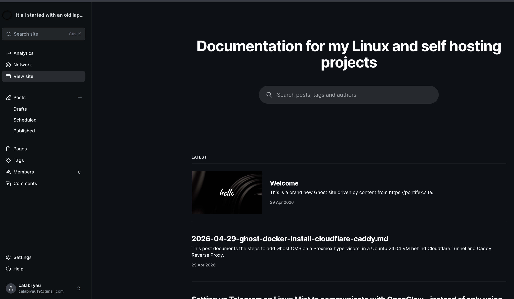

This post documents the complete installation of Ghost CMS on a dedicated Ubuntu 24.04 VM, accessed externally via a Cloudflare Tunnel with Caddy as the reverse proxy. This is not a standard Ghost install — the official Ghost Docker method requires some specific modifications to work behind this kind of infrastructure.

**Date:** April 29, 2026
**System:** Ubuntu 24.04 LTS
**VM:** testing-ubuntu-serv-vm (192.168.1.116)
**Application:** Ghost CMS 6 (Alpine)
**Public URL:** https://knowledge.pontifex.site

---



## Environment Overview

**Homelab Infrastructure:**

- Proxmox hypervisors running multiple Ubuntu VMs
- **testing-ubuntu-serv-vm** (192.168.1.116): Dedicated VM running Ghost and MySQL in Docker
- **proxy-vm** (192.168.1.74): Dedicated VM running Cloudflare Tunnel (cloudflared) and Caddy reverse proxy
- **ubuntu-web-vm** (192.168.1.72): Jekyll site source — 76 markdown posts to be imported later
- Domain: `pontifex.site` managed through Cloudflare
- Cloudflare SSL/TLS encryption mode: Full (strict)

**What Ghost replaces:**
This VM previously ran WordPress, MariaDB, PHP, Nginx, and a Directus/PostgreSQL Docker stack — all of which were removed before Ghost was installed.

**Why Ghost:**
Ghost is a modern publishing platform built specifically for content-first sites. Unlike WordPress, it is markdown-friendly, visually compelling out of the box, and runs cleanly in Docker with minimal ongoing maintenance. The goal is to use it as a new home for 76 technical homelab articles currently hosted on pontifex.site via Jekyll.

---

## Prerequisites

### VM Requirements

- Ubuntu 24.04 LTS (clean install preferred)
- Minimum 2 GB RAM, 1 CPU (Ghost + MySQL runs comfortably within this)
- 50 GB disk space
- Docker and Docker Compose installed
- Tailscale installed (for remote access)
- SSH key authentication configured

### External Requirements

- Domain managed through Cloudflare
- Existing Cloudflare Tunnel (cloudflared) running on proxy-vm
- Caddy reverse proxy running on proxy-vm
- Gmail account with 2FA enabled (for SMTP via App Password)
- Git installed on the Ghost VM

### Software Installed Before Starting

- WP-CLI (installed but not used — left over from WordPress planning)
- Pandoc (installed for future markdown conversion)

---

## Step 1: Prepare the VM

Before installing Ghost, the VM must be clean. In this case the following were removed first:

```sh
# Remove Docker stacks
cd ~/projects/modern-web-stack && docker compose down -v

# Remove WordPress files
sudo rm -rf /var/www/wordpress

# Remove MariaDB
sudo apt purge mariadb-server mariadb-client -y && sudo apt autoremove -y

# Remove PHP
sudo apt purge php8.3-fpm php8.3-common php8.3-cli php8.3-mysql php8.3-xml php8.3-curl -y && sudo apt autoremove -y

# Remove Nginx
sudo apt purge nginx nginx-common -y && sudo apt autoremove -y
```

Verify only Docker, SSH, and Tailscale remain running:

```sh
sudo systemctl list-units --type=service --state=running
```

**Important:** Back up anything worth keeping before removing services. In this case, Wolf Golf (`/var/www/wolf-golf/index.html`) was backed up first:

```sh
cp /var/www/wolf-golf/index.html ~/wolf-golf-backup.html
```

---

## Step 2: Configure Cloudflare Tunnel and Caddy

Before installing Ghost, the routing infrastructure must be in place. Ghost needs to be reachable at its public URL before it will function correctly.

NOTE: These Cloudflare steps are not exactly how I accomplished this.  Just figured it out from the existing subdomains already set up like photos.pontifex.site, books.pontifex.st, etc. Claude was not specific so sort of did it on my own. 

### Add DNS Record in Cloudflare

In the Cloudflare dashboard for `pontifex.site`, add a new CNAME record:

- **Type:** CNAME
- **Name:** knowledge
- **Target:** `YOUR-TUNNEL-UUID.cfargotunnel.com` (same as all other services)
- **Proxy status:** Proxied (orange cloud)

### Add Cloudflare Access Application

In Zero Trust → Access → Applications, add a new Self-Hosted application:

- **Application name:** knowledge
- **Subdomain:** knowledge
- **Domain:** pontifex.site
- **Policy:** Assign an existing policy (e.g., Allow Admins)

### Update cloudflared on proxy-vm

```sh
sudo nano /etc/cloudflared/config.yml
```

Add the new hostname entry before the final `http_status:404` catch-all:

```yaml
  - hostname: knowledge.pontifex.site
    service: http://localhost:80
```

Restart cloudflared:

```sh
sudo systemctl restart cloudflared
sudo systemctl status cloudflared --no-pager
```

### Update Caddy on proxy-vm

```sh
sudo nano /etc/caddy/Caddyfile
```

Add a new block for Ghost. The critical addition here is `header_up X-Forwarded-Proto https` — without this, Ghost will enter a redirect loop with Cloudflare (explained in the Troubleshooting section):

```
http://knowledge.pontifex.site {
    reverse_proxy 192.168.1.116:2368 {
        header_up X-Forwarded-Proto https
    }
}
```

Reload Caddy:

```sh
sudo systemctl reload caddy
sudo systemctl status caddy --no-pager
```

### Verify Routing

Open a browser and navigate to `https://knowledge.pontifex.site`. You should see the Cloudflare Access login prompt, then a "Bad Gateway" error after authenticating. This is correct — it confirms the tunnel is working end to end. Ghost is not running yet, so the bad gateway is expected.

---

## Step 3: Generate a Gmail App Password

Ghost requires SMTP for admin logins, password resets, and staff invitations. Gmail works well for this.

1. Go to [myaccount.google.com/apppasswords](https://myaccount.google.com/apppasswords)
2. Create a new app password — name it "Ghost"
3. Google generates a 16-character password displayed with spaces for readability
4. **Use the password without spaces** — 16 characters, no spaces, when entering it in the Ghost configuration

Keep this password on hand for the next step.

---

## Step 4: Clone the Ghost Docker Repository

SSH into the Ghost VM and clone the official Ghost Docker tooling:

```sh
sudo git clone https://github.com/TryGhost/ghost-docker.git /opt/ghost
```

Fix ownership so the `mark` user can edit the files:

```sh
sudo chown -R mark:mark /opt/ghost
```

Navigate into the directory:

```sh
cd /opt/ghost
```

Copy the example configuration files:

```sh
cp .env.example .env && cp caddy/Caddyfile.example caddy/Caddyfile
```

---

## Step 5: Configure the .env File

```sh
nano .env
```

Make the following changes:

**Domain:**
```
DOMAIN=knowledge.pontifex.site
```

**Ports** — Ghost is behind a reverse proxy, so it uses non-standard ports:
```
HTTP_PORT=2368
HTTPS_PORT=2369
```

**Database passwords** — generate two separate secure passwords:
```sh
openssl rand -hex 32
```

Run this twice and use the two outputs for:
```
DATABASE_ROOT_PASSWORD=<first generated password>
DATABASE_PASSWORD=<second generated password>
```

**SMTP configuration:**
```
mail__transport=SMTP
mail__options__host=smtp.gmail.com
mail__options__port=465
mail__options__secure=true
mail__options__auth__user=your-email@gmail.com
mail__options__auth__pass=<16-character app password, no spaces>
mail__from="'Your Name' <your-email@gmail.com>"
```

Leave all other settings at their defaults. The `GHOST_PORT` line near the bottom should remain commented out — it is only needed when running multiple Ghost instances on the same server.

---

## Step 6: Modify compose.yml

The official Ghost Docker stack includes its own Caddy container for SSL termination. Since Cloudflare and Caddy on proxy-vm already handle this, Ghost's internal Caddy must be disabled and Ghost must be exposed directly on port 2368.

```sh
nano compose.yml
```

**Edit 1:** Comment out the entire `caddy:` service block at the top of the file. Every line from `caddy:` through its closing `networks:` entry should be prefixed with `#`.

**Edit 2:** Add a `ports` section to the `ghost:` service, immediately after `restart: always`:

```yaml
  ghost:
    image: ghost:${GHOST_VERSION:-6-alpine}
    restart: always
    ports:
      - "2368:2368"
```

**Edit 3:** Add `server__trustProxy: true` to the `environment:` section of the `ghost:` service, after `NODE_ENV: production`:

```yaml
    environment:
      NODE_ENV: production
      server__trustProxy: true
      url: https://${DOMAIN:?DOMAIN environment variable is required}
```

Save and exit.

---

## Step 7: Pull Images and Start Ghost

Download the Ghost and MySQL Docker images:

```sh
docker compose pull
```

This downloads `ghost:6-alpine` and `mysql:8.0.44`. Allow a few minutes for both to complete.

Start Ghost:

```sh
docker compose up -d
```

Verify both containers are running:

```sh

docker ps --format "table {{.ID}}\t{{.Image}}\t{{.Status}}"

```

Expected output shows both containers with status `Up` and MySQL showing `(healthy)`.

---

## Step 8: Complete Ghost Setup

Navigate to `https://knowledge.pontifex.site` in your browser. After passing the Cloudflare Access login, the Ghost welcome screen should appear.

To set up the admin account, go to:

```
https://knowledge.pontifex.site/ghost
```

Complete the setup wizard — site title, admin email, and password. These can all be changed later in Settings.

---

## Troubleshooting

### ERR_TOO_MANY_REDIRECTS

**Cause:** Ghost is behind Cloudflare (which terminates SSL) and Caddy (which forwards HTTP internally). Ghost sees an HTTP request, assumes it needs to redirect to HTTPS, Cloudflare sends it back as HTTP again — infinite loop.

**Two fixes required — both are necessary:**

1. In the Caddy block on proxy-vm, pass the `X-Forwarded-Proto` header:

```
http://knowledge.pontifex.site {
    reverse_proxy 192.168.1.116:2368 {
        header_up X-Forwarded-Proto https
    }
}
```

2. In `compose.yml`, add `server__trustProxy: true` to the Ghost environment so Ghost trusts the forwarded header.

Without both of these in place, the redirect loop will persist.

**Note:** Do not change the Cloudflare SSL/TLS encryption mode for `pontifex.site` — it is set to Full (strict) which is correct for the entire domain. The fix belongs in Caddy and Ghost, not Cloudflare.

### Bad Gateway After Cloudflare Access Login

This is expected if Ghost is not yet running. Start Ghost with `docker compose up -d` from `/opt/ghost` and try again.

### Ghost Containers Not Starting

Check logs for errors:

```sh
cd /opt/ghost && docker compose logs ghost
```

```sh
docker compose logs db
```

### Cannot Find compose.yml

You must be in `/opt/ghost` to run Docker Compose commands. Navigate there first:

```sh
cd /opt/ghost
```

---

## Management Commands

### Start Ghost

```sh
cd /opt/ghost && docker compose up -d
```

### Stop Ghost

```sh
cd /opt/ghost && docker compose down
```

### View Logs

```sh
cd /opt/ghost && docker compose logs ghost
```

### Update Ghost

```sh
cd /opt/ghost
git pull
docker compose pull
docker compose up -d
docker image prune
```

### Restart Ghost After Config Change

If you edit `compose.yml`:

```sh
docker compose up -d --force-recreate ghost
```

If you change `DOMAIN` or `ADMIN_DOMAIN` in `.env`, recreate both Ghost and Caddy containers:

```sh
docker compose up -d --force-recreate ghost caddy
```

**Note:** Never change the `DATABASE_xxx` variables after the database has been initialized — this will break the database connection.

---

## Installation Summary

**Installation Directory:** `/opt/ghost`
**Public URL:** `https://knowledge.pontifex.site`
**Admin URL:** `https://knowledge.pontifex.site/ghost`
**Ghost Version:** 6 (Alpine)
**Database:** MySQL 8.0.44
**Data Location:** `/opt/ghost/data/ghost` and `/opt/ghost/data/mysql`
**SMTP:** Gmail via App Password
**Reverse Proxy:** Caddy on proxy-vm (192.168.1.74)
**Tunnel:** Cloudflare Tunnel (pontifex-proxy)
**Cloudflare Access Policy:** Allow Admins

**Installation Date:** April 29, 2026
**Installed By:** Mark
**VM:** testing-ubuntu-serv-vm (192.168.1.116)
**Status:** ✅ Running

---

## Next Steps

1. Choose and install a theme via Ghost Admin → Design
2. Configure site title, description, and branding
3. Import 76 markdown posts from ubuntu-web-vm (192.168.1.72)
4. Set up Forgejo backup for Ghost Docker Compose files
5. Add Ghost to LibreNMS monitoring
6. Consider adding Ghost VM to Proxmox backup schedule
